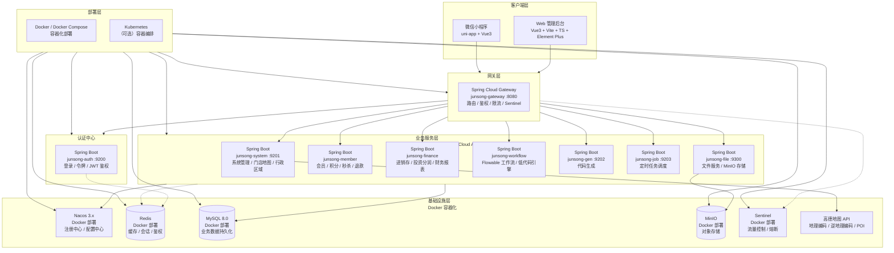

<h1 align="center">JunSong-Cloud 峻松云</h1>

<p align="center">
  <b>面向连锁门店运营的分布式微服务管理平台</b>
</p>

<p align="center">
  
  
  
  
  
  
</p>

---

## 一、项目简介

**JunSong-Cloud（峻松云）** 是一套基于 Spring Cloud Alibaba 微服务体系构建的连锁门店一体化运营管理平台。平台在通用 RBAC 权限治理之上，深度沉淀了 **会员营销、财务核算、门店地理分布、低代码工作流** 等连锁经营核心业务能力，并配套微信小程序作为移动端延伸。

平台具备以下特色：

- **现代技术栈**：后端 Spring Boot 4.x + Spring Cloud 2025.x + JDK 17，前端 Vue 3.5 + Vite 8 + TypeScript + Element Plus。
- **微服务架构**：以 Nacos 为注册/配置中心，Gateway 统一网关，Redis 鉴权，按业务域拆分独立服务。
- **业务驱动**：覆盖会员积分/秒杀/退款、进销存与投资人分润核算、门店地图选址与开业流程、Flowable 工作流。
- **低代码能力**：基于元数据可视化配置业务表单与审批流程，自动装配流程变量，加速业务交付。
- **地理可视化**：集成高德地图，支持门店地图查询、门店密度热力分析、地图选点回填省市区街道。

---

## 二、技术栈

### 后端

| 技术 | 版本 | 说明 |
| :--- | :--- | :--- |
| Spring Boot | 4.0.3 | 基础框架 |
| Spring Cloud | 2025.1.0 | 微服务框架 |
| Spring Cloud Alibaba | 2025.1.0.0 | 阿里微服务套件 |
| JDK | 17 | 运行环境 |
| Nacos | 3.x | 注册中心 / 配置中心 |
| MyBatis / PageHelper | - | 持久层 / 分页 |
| Redis | - | 缓存 / 鉴权 |
| Flowable | - | 工作流引擎 |
| Sentinel | - | 流量控制 |
| MinIO | - | 对象存储 |
| JJWT | - | 令牌鉴权 |
| SpringDoc OpenAPI | - | 接口文档 |

### 前端

| 技术 | 版本 | 说明 |
| :--- | :--- | :--- |
| Vue | 3.5 | 渐进式框架 |
| Vite | 8 | 构建工具 |
| TypeScript | 6 | 脚本语言 |
| Element Plus | 2.14 | UI 组件库 |
| Pinia | 3 | 状态管理 |
| Vue Router | 4 | 路由管理 |
| ECharts | 6 | 数据图表 |
| Leaflet | 1.9 | 地图渲染（高德瓦片） |
| Axios | 1.x | HTTP 客户端 |

### 移动端

- **uni-app + Vue 3** 构建的微信小程序「峻松店记」，承载会员与财务运营的移动场景。

---

## 三、技术架构图



---

## 四、系统模块

```
com.junsong
├── junsong-gateway          // 网关模块 [8080]：路由转发、鉴权、限流
├── junsong-auth             // 认证中心 [9200]：登录、令牌、权限校验
├── junsong-api              // 接口模块：对外 Feign 接口定义
├── junsong-common           // 通用模块
│   ├── junsong-common-core          // 核心工具
│   ├── junsong-common-datascope     // 数据权限
│   ├── junsong-common-datasource    // 多数据源
│   ├── junsong-common-log           // 操作日志
│   ├── junsong-common-redis         // 缓存服务
│   ├── junsong-common-security      // 安全模块
│   ├── junsong-common-sensitive     // 数据脱敏
│   └── junsong-common-swagger       // 接口文档
├── junsong-modules          // 业务模块
│   ├── junsong-system       // 系统管理 [9201]：RBAC、门店地图、行政区域、看板
│   ├── junsong-member       // 会员营销：会员、积分、秒杀、退款、小程序权限
│   ├── junsong-finance      // 财务核算：进销存、投资人分润、报表、票据 OCR
│   ├── junsong-workflow     // 工作流：Flowable 引擎 + 低代码配置引擎
│   ├── junsong-gen          // 代码生成 [9202]
│   ├── junsong-job          // 定时任务 [9203]
│   └── junsong-file         // 文件服务 [9300]
├── junsong-visual           // 图形化管理
├── junsong-ui-v3            // 前端工程 (Vue3 + Vite + TS)
└── junsong-miniprogram      // 微信小程序 (uni-app + Vue3)
```

---

## 五、核心业务功能

### 系统管理（junsong-system）
- 通用后台：用户、角色、菜单、部门、岗位、字典、参数、通知公告、操作/登录日志、在线用户、个人中心。
- 业务扩展：**行政区域管理**（全国省市区街道）、**门店地图查询**、**门店密度热力分析**、**门店开业流程**、用户-部门关系、统计看板。

### 会员营销（junsong-member）
- 会员信息管理与会员卡体系。
- 积分体系：积分规则、积分商品、积分记录、积分兑换。
- 营销活动：秒杀活动与秒杀记录、退款申请。
- 小程序管理与权限、会员/秒杀运营报表。

### 财务核算（junsong-finance）
- 进销存：商品、供应商、进货单、销售记录、费用记录、借支管理。
- 投资分润：投资人管理、投资款记录、投资人返款、店面分润配置、分润结转。
- 核算报表：核算周期、成本核算，及成本/费用/利润/分润/销售/库存多维报表。
- 票据 OCR 识别。

### 工作流与低代码（junsong-workflow）
- **引擎层**：基于 Flowable 的流程定义、流程实例（发起/查询/终止）、任务处理（待办/已办/签收/审批/驳回/转办）、历史流转与流程跟踪图。
- **低代码层**：通过元数据（业务对象、字段、页面 Schema、节点处理人、分支规则）可视化配置业务表单并自动装配流程变量，支持按部门动态选审批人与配置化后置动作，已落地门店开业、会员退款等审批场景。

### 开发支撑
- **代码生成**（junsong-gen）：数据库表导入、字段编辑、预览并生成前后端 CRUD 代码。
- **定时任务**（junsong-job）：任务调度增删改查、立即执行、启停与调度日志。
- **文件服务**（junsong-file）：统一附件/图片存储（MinIO）。

---

## 六、环境要求

| 组件 | 版本要求 |
| :--- | :--- |
| JDK | 17+ |
| Maven | 3.8+ |
| Node.js | 18+ |
| MySQL | 8.0+ |
| Redis | 6.0+ |
| Nacos | 3.x |
| MinIO | 最新稳定版 |

---

## 七、快速开始

### 1. 准备配置文件

项目敏感配置（数据库密码、Nacos 密码等）均已脱敏，使用前需基于模板填写真实值：

```bash
cd docker
cp .env.example .env
# 编辑 .env，填写 MYSQL_ROOT_PASSWORD / NACOS_PASSWORD / NACOS_AUTH_TOKEN 等
```

> `docker/nacos/conf/` 下的配置文件中，数据库密码、MinIO 密钥等敏感项以 `change-me` 占位，导入 Nacos 前请替换为真实值。

### 2. 初始化数据库

导入 `sql/` 目录下的初始化脚本（业务库、配置库等），具体顺序参考脚本命名。

### 3. 启动后端

```bash
# 编译打包
mvn clean package -DskipTests

# 或使用 Docker Compose 一键启动基础设施 + 微服务
cd docker
docker compose up -d
```

### 4. 启动前端

```bash
cd junsong-ui-v3
npm install
npm run dev
```

### 5. 启动小程序

使用 HBuilderX 或微信开发者工具打开 `junsong-miniprogram` 目录，配置网关地址后运行。

---

## 八、目录结构

```
JunSong-Cloud
├── junsong-gateway/         # 网关
├── junsong-auth/            # 认证中心
├── junsong-api/             # Feign 接口
├── junsong-common/          # 通用模块
├── junsong-modules/         # 业务微服务
├── junsong-visual/          # 图形化管理
├── junsong-ui-v3/           # 前端工程
├── junsong-miniprogram/     # 微信小程序
├── docker/                  # 容器编排与配置（敏感信息已脱敏）
├── sql/                     # 数据库初始化脚本
└── pom.xml                  # 父级依赖管理
```

---

## 九、安全说明

- 仓库中所有配置文件的密码、密钥均已替换为 `change-me` 占位符，**不包含任何生产环境真实凭据**。
- 高德地图 Key 等业务密钥通过数据库系统参数表在运行时加载，不硬编码于代码中。
- 部署时请妥善保管 `docker/.env` 等本地配置文件，切勿提交至版本库。

---

## 十、License

本项目采用 [MIT](./LICENSE) 协议开源。
