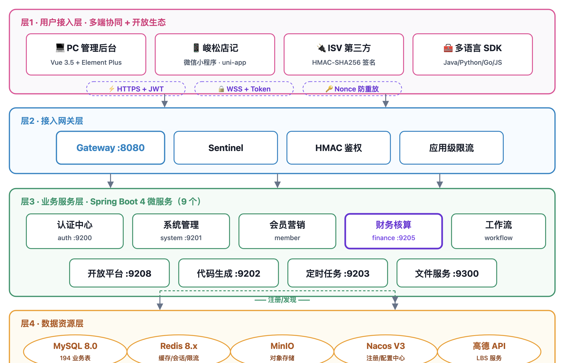

<h1 align="center">JunSong-Cloud 峻松云</h1>

<p align="center">
  <b>面向连锁门店运营的分布式微服务管理平台</b>
</p>

<p align="center">
  
  
  
  
  
  
</p>

---

## 一、项目简介

**JunSong-Cloud（峻松云）** 是一套基于 Spring Cloud Alibaba 微服务体系构建的连锁门店一体化运营管理平台。平台在通用 RBAC 权限治理之上，深度沉淀了 **经营决策、财务闭环、会员增长、系统治理、开放平台、低代码工作流** 等连锁经营核心业务能力，并配套微信小程序作为移动端延伸。

平台具备以下特色：

- **现代技术栈**：后端 Spring Boot 4.0.3 + Spring Cloud 2025.1.0 + Spring Cloud Alibaba 2025.1.0.0 + JDK 17，前端 Vue 3.5 + Vite 8 + TS 6 + Element Plus 2.14，小程序 uni-app 3.0 + Vue 3.4 + Pinia 2.1。
- **微服务架构**：以 Nacos V3 为注册/配置中心，Gateway 统一网关，JWT 鉴权，按业务域拆分 8 个独立服务。
- **多租户与数据权限**：基于 `TenantContext` + `TenantSqlInterceptor` 的 SQL 级租户隔离，`@DataScope` 注解的部门级数据权限双控。
- **幂等性框架**：自研 `@Idempotent` 注解 + `X-Idempotency-Key` 请求头，Redis 快速通道 + DB 持久化兜底，防止重复提交。
- **经营决策**：提供经营总览、财务概览、会员概览、系统概览、待办任务、异常预警和复盘动作入口。
- **财务闭环**：覆盖进销存、库存三层（快照+流水+成本层）、费用核销/反核销、投资分润、应收催收、现金流预测、经营复盘、质量评分和知识库。
- **会员增长**：覆盖会员资料、积分、等级、签到、分层、增长动作、活动 ROI 和生命周期任务。
- **开放平台**：提供 HMAC-SHA256 签名鉴权、可信 `X-Open-*` 上下文、应用级限流、多语言 SDK、Webhook 订阅、调用日志和内部接口隔离。
- **业务驱动**：覆盖门店地图选址、门店开业流程、Flowable 工作流、低代码表单和移动端运营场景。
- **低代码能力**：基于元数据可视化配置业务表单与审批流程，自动装配流程变量，加速业务交付。
- **地理可视化**：集成高德地图，支持门店地图查询、门店密度热力分析、地图选点回填省市区街道。
- **可观测性与治理**：Prometheus + Grafana + Loki 全链路监控，Spring Boot Admin 实例健康，叠加敏感数据脱敏、高危操作审计、数据归档、告警事件和性能基线。
- **云原生就绪**：GitHub Actions CI/CD 流水线 + Kubernetes 部署清单（含 HPA 自动扩缩、Ingress 路由）。
- **双端协同**：PC 管理后台与微信小程序「峻松店记」共享同一套后端权限码与 API，移动端覆盖会员运营、库存查询、进货退货、借支核销、工作流待办等场景。

---

## 二、技术栈

### 后端

| 技术 | 版本 | 说明 |
| :--- | :--- | :--- |
| Spring Boot | 4.0.3 | 基础框架 |
| Spring Cloud | 2025.1.0 | 微服务框架 |
| Spring Cloud Alibaba | 2025.1.0.0 | 阿里微服务套件 |
| JDK | 17 | 运行环境 |
| Nacos | 3.x（V3 API） | 注册中心 / 配置中心（grpc 长连接） |
| MyBatis | 4.0.1 | 持久层（XML 映射 + 多租户 SQL 拦截） |
| PageHelper | 2.1.0 | 分页插件 |
| dynamic-datasource | 4.5.0 | 多数据源（@Master/@Slave） |
| Druid | 1.2.28 | 数据库连接池 / SQL 监控 |
| Redis | 6.0+（PROD 8.x） | 缓存 / 会话 / 鉴权 / 限流计数器 |
| Flowable | 8.0.0 | 工作流引擎（BPMN 2.0，原生支持 Spring Boot 4） |
| Sentinel | 1.8.9 | 流量控制 / 熔断降级（alibaba-csp） |
| Seata | 2.5.0 | 分布式事务（Apache Seata，AT 模式预留） |
| MinIO | 8.2.2 | S3 兼容对象存储 |
| JJWT | 0.9.1 | JWT 令牌签发与校验 |
| SpringDoc OpenAPI | 3.0.2 | 接口文档（Knife4j 4.5.0 增强） |
| FastJson2 | 2.0.61 | JSON 序列化（Redis 存储） |
| Kaptcha | 2.3.3 | 图形验证码 |
| Apache POI | 4.1.2 | Excel 导入导出 |
| Velocity | 2.3 | 代码生成模板引擎 |
| TransmittableThreadLocal | 2.14.5 | 跨线程上下文传递（链路日志） |
| JSqlParser | 5.3 | SQL 解析（多租户拦截器） |
| Spring Boot Admin | 4.0.2 | 微服务实例健康监控 |
| Micrometer | 1.16.3 | 指标采集（Prometheus） |

### 前端

| 技术 | 版本 | 说明 |
| :--- | :--- | :--- |
| Vue | 3.5 | 渐进式框架 |
| Vite | 8 | 构建工具 |
| TypeScript | 6 | 脚本语言 |
| Element Plus | 2.14 | UI 组件库 |
| Pinia | 3 | 状态管理（含持久化插件） |
| Vue Router | 4 | 路由管理 |
| ECharts | 6 | 数据图表 |
| bpmn-js | 18 | BPMN 流程图渲染（工作流设计器） |
| Leaflet | 1.9 | 地图渲染（高德瓦片） |
| SortableJS | 1.15 | 拖拽排序（模块卡片 / 表格行） |
| ExcelJS | 4.4 | Excel 读写 |
| Axios | 1.x | HTTP 客户端 |
| JSEncrypt | 3.0 | RSA 加密（登录密码） |
| STOMP.js + SockJS | 7.3 / 1.6 | WebSocket 实时通信 |
| unplugin-auto-import | 21 | API 自动导入 |
| unplugin-vue-components | 32 | 组件自动导入 |

### 移动端（微信小程序「峻松店记」）

| 技术 | 版本 | 说明 |
| :--- | :--- | :--- |
| uni-app | 3.0.0-5000 | 跨端框架（@dcloudio） |
| Vue | 3.4 | 视图框架 |
| Pinia | 2.1 | 状态管理 |
| Vite | 5.2 | 构建工具 |
| WeChat MiniProgram | - | 目标平台 |

> 小程序承载会员运营、库存查询、进货单、退货单、借支、费用核销、工作流待办/已办/通知等移动场景，与 PC 端共享同一套后端权限码与 API。

---

## 三、技术架构图

****

> 📷 以上为 PNG 高清大图（2x DPR 浏览器渲染截图，PingFang SC 中文字体 + 蓝/粉/绿/琥珀/灰 5 色分层矩阵式），保证 GitHub / Gitee / VS Code / Typora / Notion / 语雀 **像素级一致显示**，不会出现子图错位、连线乱穿、字体缺失等问题。
>
> 五层严格矩阵式分层（自上而下）：
>
> - 🟥 **用户接入层（客户端）**：PC 管理后台 / 峻松店记小程序 / ISV 第三方 / 多语言 SDK，HTTPS+JWT / WSS+Token / Nonce 防重放 三种协议；
> - 🟦 **接入网关层（流量入口）**：Gateway :8080 / Sentinel / HMAC 鉴权 / 应用级限流；
> - 🟩 **业务服务层（9 个微服务）**：认证中心 / 系统管理 / 会员营销 / **财务核算 ⭐（紫粗框高亮）** / 工作流 + 开放平台 / 代码生成 / 定时任务 / 文件服务 共 9 个，通过 Nacos 注册/发现虚线互联；
> - 🟧 **数据资源层（存储/中间件）**：MySQL 8.0 · Redis 8.x · MinIO · Nacos V3 · 高德 API 五项椭圆式资源；
> - ⬛ **基础设施层（运维/可观测）**：Docker / Kubernetes / GitHub Actions / Prometheus / Grafana / Loki 六项云原生底座。

### 架构亮点矩阵 · Highlights（9 维）

| 维度 | 核心能力 |
| :--- | :--- |
| 🔷 **现代技术栈** | 后端 Spring Boot 4.0.3 + Spring Cloud 2025.1.0 + SCA 2025.1.0.0 + JDK 17；前端 Vue 3.5 + Vite 8 + TS 6 + Element Plus 2.14 |
| 🧩 **微服务治理** | Nacos V3 注册/配置 · OpenFeign + LoadBalancer · Sentinel 1.8.9 限流熔断 · Seata 2.5.0 分布式事务 · @Idempotent 幂等性框架 |
| 🔐 **安全防御** | JJWT 0.9.1 鉴权 · HMAC-SHA256 + Nonce · `@InnerAuth` + `X-Inner-Token` 内部隔离 · `@Sensitive` 脱敏 · RBAC + `@DataScope` 双控 |
| 📊 **数据层** | MySQL 8.0 (utf8mb4 · 194 表) · Druid 1.2.28 连接池 · Redis 8.x (FastJson2) · MinIO · MyBatis 4.0.1 · dynamic-ds 4.5 · JSqlParser 5.3 多租户 |
| 🛰️ **云原生** | Docker / Compose 一键部署 · K8s (HPA + Ingress + 36 份清单) · GitHub Actions 3 条 CI/CD 流水线 |
| 📈 **可观测性** | Prometheus · Grafana · Loki · Spring Boot Admin 4.0.2 · Micrometer 1.16.3 · Logback + TTL 链路追踪 |
| 🌐 **多端协同** | PC 管理后台 · 微信小程序「峻松店记」· 开放平台 SDK 4 语种（Java/Python/Go/JS）· ISV 应用接入 |
| 🗺️ **LBS 能力** | 高德 API · 地理编码/逆地理/POI · 门店密度热力 · Leaflet 1.9 瓦片渲染 |
| ⚙️ **业务中台** | Flowable 8.0.0 BPM · 低代码表单引擎 · 多租户 + 多门店数据权限 · 经营驾驶舱 · 现金流预测 · 费用核销幂等保护 |

> 💡 完整架构设计四视图（**系统架构图 / 应用架构图 / 技术架构图 / 功能架构图**）已改为 GitHub 兼容的独立 SVG 资源，请查看：
> [`docs/superpowers/specs/2026-08-09-峻松云架构设计四视图.zh-CN.md`](./docs/superpowers/specs/2026-08-09-峻松云架构设计四视图.zh-CN.md)

---

## 四、系统模块

```
com.junsong
├── junsong-gateway          // 网关模块 [8080]：路由转发、JWT 鉴权、限流、HMAC 签名、应用级限流
├── junsong-auth             // 认证中心 [9200]：登录、令牌签发、JJWT 鉴权、图形验证码
├── junsong-api              // 接口模块：对外 Feign 接口定义（junsong-api-system 等）
├── junsong-common           // 通用模块（9 个子模块）
│   ├── junsong-common-core          // 核心工具 · 多租户上下文 · 幂等性框架 · XSS 过滤 · 工作流实体基类
│   ├── junsong-common-datascope     // 数据权限（@DataScope 注解 + AOP）
│   ├── junsong-common-datasource    // 多数据源（@Master/@Slave + dynamic-ds 4.5）
│   ├── junsong-common-log           // 操作日志（@Log 注解 + 异步落库）
│   ├── junsong-common-redis         // 缓存服务 · FastJson2 序列化 · 幂等性快速通道
│   ├── junsong-common-seata         // 分布式事务（Seata AT 模式预留）
│   ├── junsong-common-security      // 安全模块 · @RequiresPermissions/@RequiresRoles · @InnerAuth · Feign 拦截器
│   ├── junsong-common-sensitive     // 数据脱敏（@Sensitive 注解 + Jackson 序列化器）
│   └── junsong-common-swagger       // 接口文档（SpringDoc OpenAPI 自动配置）
├── junsong-modules          // 业务模块（8 个微服务）
│   ├── junsong-system       // 系统管理 [9201]：RBAC、行政区域、门店地图、治理审计、归档告警
│   ├── junsong-member       // 会员营销：会员档案、积分商城、等级、增长动作、活动 ROI、小程序权限
│   ├── junsong-finance      // 财务核算 [9205]：进销存、费用核销/反核销、投资分润、现金流预测、成本核算
│   ├── junsong-workflow     // 工作流：Flowable BPM + 低代码配置引擎
│   ├── junsong-open         // 开放平台 [9208]：应用密钥、Webhook、调用日志、内部接口隔离
│   ├── junsong-gen          // 代码生成 [9202]：Velocity 模板 + 前后端 CRUD 代码
│   ├── junsong-job          // 定时任务 [9203]：Quartz 调度 + 调度日志
│   └── junsong-file         // 文件服务 [9300]：MinIO 对象存储 + 本地存储
├── junsong-visual           // 图形化管理（junsong-monitor：Spring Boot Admin 实例监控）
├── junsong-ui-v3            // 前端工程（Vue 3.5 + Vite 8 + TS 6 + Element Plus 2.14）
└── junsong-miniprogram      // 微信小程序「峻松店记」（uni-app 3.0 + Vue 3.4 + Pinia 2.1）
```

---

## 五、核心业务功能

> 完整功能清单请参阅 [功能清单.md](./功能清单.md)，以下为各模块能力概述。

### 系统管理（junsong-system）
- 通用后台：用户、角色、菜单、部门、岗位、字典、参数、通知公告、操作/登录日志、在线用户、个人中心。
- 业务扩展：**行政区域管理**（全国省市区街道）、**门店地图查询**、**门店密度热力分析**、**门店开业流程**、用户-部门关系、统计看板、治理审计、数据归档和告警事件。

### 会员营销（junsong-member）
- 会员信息管理、会员卡体系、等级、签到与会员分层。
- 积分体系：积分规则、积分商品、积分记录、积分兑换。
- 增长运营：增长动作生成、执行、效果回填、活动 ROI 和生命周期任务。
- 营销活动：秒杀活动与秒杀记录、退款申请。
- 小程序管理与权限、会员/秒杀运营报表。

### 财务核算（junsong-finance :9205）
- **进销存**：商品、供应商、进货单、销售记录、销售收款、费用记录、借支管理。
- **库存三层**：库存快照 + 库存流水 + 库存账（成本层），支持库存初始化、库存盘点、库存调整。
- **费用核销**：批量核销/反核销、幂等性保护、条件更新 + 乐观锁、快照校验、下游使用拦截、LEGACY 批次保护。
- **投资分润**：投资人管理、投资款记录、投资人返款、店面分润配置、分润结转。
- **经营闭环**：应收催收、承诺回款、现金流预测、复盘任务、复盘质量评分、复盘知识库。
- **预测辅助**：现金流、应收、会员动作和库存风险的可解释预测，以及只读 what-if 模拟。
- **核算报表**：会计期间、复合核算池、移动加权成本核算，及成本/费用/利润/分润/销售/库存多维报表。
- **票据 OCR 识别**（基于 PaddleOCR）。

### 工作流与低代码（junsong-workflow）
- **引擎层**：基于 Flowable 的流程定义、流程实例（发起/查询/终止）、任务处理（待办/已办/签收/审批/驳回/转办）、历史流转与流程跟踪图。
- **低代码层**：通过元数据（业务对象、字段、页面 Schema、节点处理人、分支规则）可视化配置业务表单并自动装配流程变量，支持按部门动态选审批人与配置化后置动作，已落地门店开业、会员退款等审批场景。

### 开发支撑
- **代码生成**（junsong-gen）：数据库表导入、字段编辑、预览并生成前后端 CRUD 代码。
- **定时任务**（junsong-job）：任务调度增删改查、立即执行、启停与调度日志。
- **文件服务**（junsong-file）：统一附件/图片存储（MinIO）。

### 开放平台（junsong-open）

> 详细演进规划请参阅 [OPEN_PLATFORM_ROADMAP.md](./OPEN_PLATFORM_ROADMAP.md)，开发者快速入门请参阅 [OPEN_API_QUICKSTART.md](./OPEN_API_QUICKSTART.md)。

- **应用与密钥管理**：开发者注册应用，自动发放测试 Key（100 次/天），管理员审批后发放生产 Key（10000 次/天）。
- **HMAC-SHA256 签名鉴权**：网关 `ApiKeyAuthFilter` 校验请求签名，防篡改 + 时间戳（5 分钟有效）+ Nonce 防重放（10 分钟）。
- **可信上下文**：网关验签后注入 `X-Open-*` 上下文，开放服务按应用、租户和请求 ID 透传下游。
- **调用日志与 Webhook**：成功、拒绝、限流和异常请求写入调用日志，Webhook 订阅持久化并绑定应用与租户。
- **内部接口隔离**：内部端点使用 `@InnerAuth` 与 `X-Inner-Token`，open 服务端口仅在 Docker 内网暴露。
- **多版本 API 路由**：`/openapi/v1/**`（已废弃）、`/openapi/v2/**`（稳定版）、`/openapi/latest/**`（别名），自动添加 `Deprecation` / `Sunset` 响应头。
- **应用级限流**：`RateLimitFilter` 基于 Redis 计数器实现每日配额限流，响应头返回 `X-RateLimit-Limit` / `X-RateLimit-Remaining`。
- **差异化能力即服务**：工作流即服务、会员能力即服务、门店选址即服务，共 30 个开放 API 端点。
- **多语言 SDK**：基于 OpenAPI Generator 自动生成 Java / Python / Go / JavaScript 四种语言 SDK，详见 [sdk/](./sdk) 目录。

### 可观测性与云原生

- **指标监控**：Prometheus 采集 9 个微服务的 JVM / HTTP / 自定义指标，Grafana 可视化面板（http://localhost:3000）。
- **日志聚合**：Promtail 采集所有 Docker 容器日志到 Loki，支持按容器名、时间范围检索。
- **CI/CD 流水线**：3 个 GitHub Actions workflow（CI 编译、CD-Docker 镜像、CD-K8s 部署），详见 [.github/workflows/](./.github/workflows)。
- **Kubernetes 部署**：36 个 K8s 资源清单（Deployment / Service / Ingress / HPA / ConfigMap），详见 [k8s/](./k8s) 目录。

---

## 六、环境要求

| 组件 | 版本要求 | 说明 |
| :--- | :--- | :--- |
| JDK | 17+ | 后端运行环境 |
| Maven | 3.8+ | 后端构建 |
| Node.js | 18+ | 前端 / 小程序构建 |
| pnpm | 8+ | 前端包管理（推荐） |
| MySQL | 8.0+ | 业务数据持久化（utf8mb4） |
| Redis | 6.0+（PROD 实际 8.x） | 缓存 / 会话 / 鉴权 |
| Nacos | 3.x | 注册中心 / 配置中心（V3 API） |
| MinIO | 最新稳定版 | 对象存储 |
| Docker & Compose | 最新稳定版 | 容器化部署 |
| 微信开发者工具 | 最新稳定版 | 小程序调试与上传 |

---

## 七、快速开始

### 1. 准备配置文件

项目敏感配置（数据库密码、Nacos 密码等）均已脱敏，使用前需基于模板填写真实值：

```bash
cd docker
cp .env.example .env
# 编辑 .env，填写 MYSQL_ROOT_PASSWORD / NACOS_PASSWORD / NACOS_AUTH_TOKEN 等
```

> `docker/nacos/conf/` 下的配置文件中，数据库密码、MinIO 密钥等敏感项以 `change-me` 占位，导入 Nacos 前请替换为真实值。

### 2. 初始化数据库

使用 v1.1.0 一键初始化脚本（194 张业务表 DDL + 27 张基础表预置数据）：

```bash
bin/deploy-sql.sh sql/JunSong-Cloud-v1.1.0-数据库初始化-系统库.sql dev
```

> 所有非 ASCII SQL 已强制 `SET NAMES utf8mb4;`，客户端使用 `--default-character-set=utf8mb4`。

### 3. 启动后端

```bash
# 编译打包
mvn clean package -DskipTests

# 或使用 Docker Compose 一键启动基础设施 + 微服务
cd docker
docker compose up -d
```

### 4. 启动前端（PC 管理后台）

```bash
cd junsong-ui-v3
pnpm install      # 或 npm install
pnpm run dev      # 或 npm run dev
```

### 5. 启动小程序

```bash
cd junsong-miniprogram
npm install
npm run build:mp-weixin    # 构建到 dist/build/mp-weixin
```

使用微信开发者工具打开 `junsong-miniprogram` 目录（或 `dist/build/mp-weixin`），配置网关地址后运行。

### 6. 健康检查

```bash
# 后端容器状态
docker ps --format 'table {{.Names}}\t{{.Status}}\t{{.Ports}}'

# 网关健康检查
curl -s http://127.0.0.1:8081/actuator/health

# 前端页面
curl -I http://127.0.0.1/

# PC 管理后台健康脚本
npm run admin:health
```

---

## 八、目录结构

```
JunSong-Cloud
├── junsong-gateway/         # 网关（Spring Cloud Gateway）
├── junsong-auth/            # 认证中心（JWT）
├── junsong-api/             # Feign 接口定义
├── junsong-common/          # 通用模块（9 个子模块：core/datascope/datasource/log/redis/seata/security/sensitive/swagger）
├── junsong-modules/         # 业务微服务（8 个：system/member/finance/workflow/open/gen/job/file）
├── junsong-visual/          # 图形化管理（Spring Boot Admin 监控）
├── junsong-ui-v3/           # 前端工程（Vue 3.5 + Vite 8 + TS 6 + Element Plus）
├── junsong-miniprogram/     # 微信小程序「峻松店记」（uni-app + Vue 3，嵌套 Git 仓库）
├── sdk/                     # 开放平台多语言 SDK（Java / Python / Go / JS）+ 调用示例
├── k8s/                     # Kubernetes 部署清单（Deployment / Service / Ingress / HPA / ConfigMap）
├── docker/                  # 容器编排与配置（敏感信息已脱敏，含 .env.example）
├── .github/workflows/       # GitHub Actions CI/CD 流水线（CI 编译 / CD-Docker / CD-K8s）
├── e2e/                     # 端到端测试（Playwright，覆盖 auth/dashboard/workflow/lowcode/security）
├── perf/                    # 性能压测场景（k6，覆盖 finance/lowcode/member）
├── scripts/                 # 契约测试与健康检查脚本（admin-health / three-module-regression 等）
├── sql/                     # 数据库脚本（v1.1.0 初始化 + 历史迁移 + PROD 数据修复）
├── bin/                     # 部署脚本（deploy-*.sh / deploy-sql.sh / switch-env.sh）
└── pom.xml                  # 父级依赖管理
```

---

## 九、安全说明

- 仓库中所有配置文件的密码、密钥均已替换为 `change-me` 占位符，**不包含任何生产环境真实凭据**。
- 高德地图 Key 等业务密钥通过数据库系统参数表在运行时加载，不硬编码于代码中。
- 部署时请妥善保管 `docker/.env` 等本地配置文件，切勿提交至版本库。

---

## 十、License

本项目采用 **峻松云软件使用许可协议** 开源，核心要点：
- **可自由使用**：允许下载、使用、复制、修改、分发本软件。
- **不提供技术支持**：开发者不提供任何形式的技术支持、咨询或问题解决方案。
- **免责声明**：软件按"原样"提供，因使用本软件导致的任何直接或间接损失，开发者不承担任何责任。

完整协议内容请参阅 [LICENSE](./LICENSE) 文件。
