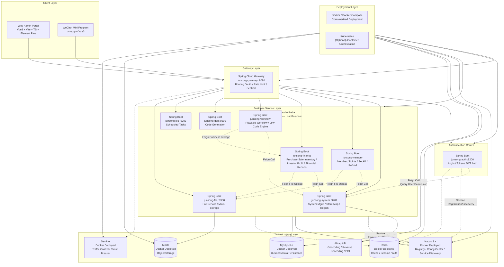

# JunSong-Cloud

> **A Distributed Microservices Platform for Chain Store Operations**

<p align="center">
  
  
  
  
  
  
</p>

---

## Overview

**JunSong-Cloud** is a distributed microservices platform built on **Spring Cloud Alibaba**, designed for chain store operations management. Beyond standard RBAC governance, it deeply integrates core chain-retail capabilities including **member marketing, financial accounting, store geospatial distribution, and low-code workflow orchestration**, with a WeChat Mini Program as the mobile extension.

### Key Features

- **Modern Tech Stack**: Backend Spring Boot 4.x + Spring Cloud 2025.x + JDK 17; Frontend Vue 3.5 + Vite 8 + TypeScript + Element Plus
- **Microservices Architecture**: Nacos as registry/config center, Gateway as unified entry, Redis for auth caching, domain-driven service decomposition
- **Business-Driven**: Member points/seckill/refund, purchase-sale-inventory & investor profit sharing, store map location & opening workflow, Flowable workflow engine
- **Low-Code Capability**: Metadata-driven visual form & approval flow configuration, automatic process variable assembly, accelerated business delivery
- **Geospatial Visualization**: Integrated AMap (AutoNavi) for store map queries, density heatmap analysis, and address cascading回填 (province/city/district/street)

---

## Tech Stack

### Backend

| Technology | Version | Description |
| :--- | :--- | :--- |
| Spring Boot | 4.0.3 | Core framework |
| Spring Cloud | 2025.1.0 | Microservices framework |
| Spring Cloud Alibaba | 2025.1.0.0 | Alibaba microservices suite |
| JDK | 17 | Runtime |
| Nacos | 3.x | Registry & Config Center |
| MyBatis / PageHelper | - | Persistence / Pagination |
| Redis | - | Cache / Authentication |
| Flowable | - | Workflow engine |
| Sentinel | - | Traffic control |
| MinIO | - | Object storage |
| JJWT | - | Token authentication |
| SpringDoc OpenAPI | - | API documentation |

### Frontend

| Technology | Version | Description |
| :--- | :--- | :--- |
| Vue | 3.5 | Progressive framework |
| Vite | 8 | Build tool |
| TypeScript | 6 | Scripting language |
| Element Plus | 2.14 | UI component library |
| Pinia | 3 | State management |
| Vue Router | 4 | Routing |
| ECharts | 6 | Data visualization |
| Leaflet | 1.9 | Map rendering (AMap tiles) |
| Axios | 1.x | HTTP client |

### Mobile

- **uni-app + Vue 3** WeChat Mini Program "JunSong Store" for mobile member & financial operations.

---

## Architecture



> **Inter-Service Communication**
> - **OpenFeign**: Declarative REST calls between services
> - **Nacos Service Discovery**: Services register on startup; Feign resolves via service name (`lb://service-name`)
> - **Spring Cloud LoadBalancer**: Client-side load balancing for multi-instance services
> - **Sentinel**: Traffic control and circuit breaking for Feign calls and gateway entry
> - **Context Propagation**: Feign interceptor automatically passes user tokens downstream

---

## System Modules

```
com.junsong
├── junsong-gateway          // Gateway [8080]: Routing, Auth, Rate Limit
├── junsong-auth             // Auth Center [9200]: Login, Token, Permission Check
├── junsong-api              // API Module: External Feign interface definitions
├── junsong-common           // Common Modules
│   ├── junsong-common-core          // Core utilities
│   ├── junsong-common-datascope     // Data scope permissions
│   ├── junsong-common-datasource    // Multi-datasource
│   ├── junsong-common-log           // Operation logging
│   ├── junsong-common-redis         // Cache service
│   ├── junsong-common-security      // Security module
│   ├── junsong-common-swagger       // API docs (Knife4j)
│   └── ...
├── junsong-modules          // Business Services
│   ├── junsong-system       // System Management [9201]
│   ├── junsong-gen          // Code Generation [9202]
│   ├── junsong-job          // Scheduled Tasks [9203]
│   ├── junsong-finance      // Finance / Purchase-Sale-Inventory [9205]
│   ├── junsong-member       // Member / Points / Seckill [9206]
│   ├── junsong-workflow     // Workflow / Low-Code Engine [9207]
│   └── junsong-file         // File Service [9300]
├── junsong-visual           // Monitoring [9100]
├── junsong-ui-v3            // PC Frontend (Vue3 + Vite)
├── junsong-miniprogram      // WeChat Mini Program (uni-app)
└── docker                   // Docker Compose orchestration
```

---

## Quick Start

```bash
# Clone
git clone https://github.com/siruscs/JunSong.git
cd JunSong

# One-command startup (Docker required)
cd docker
sh deploy.sh base && sleep 60 && sh deploy.sh all

# Open browser
open http://localhost
# Account: admin / admin123
```

See [QUICKSTART.md](./QUICKSTART.md) for details.

---

## Documentation

| Document | Description |
|----------|-------------|
| [README.md](./README.md) | Chinese version of this document |
| [QUICKSTART.md](./QUICKSTART.md) | 5-minute quick start guide |
| [部署运维手册.md](./部署运维手册.md) | Deployment & Operations Manual (13 services, on-demand startup, PROD deployment) |
| [二次开发指南.md](./二次开发指南.md) | Secondary Development Guide (create a new service in 11 steps) |
| [API.md](./API.md) | API Documentation (auth, 7 modules, curl/axios examples) |
| [DATABASE_DESIGN.md](./DATABASE_DESIGN.md) | Database Design (core tables, ER relationships) |
| [CONTRIBUTING.md](./CONTRIBUTING.md) | Contribution Guide (environment, code style, branch strategy, PR process) |
| [CHANGELOG.md](./CHANGELOG.md) | Version History |
| [SECURITY.md](./SECURITY.md) | Security Policy (vulnerability reporting, security checklist) |
| [docs/lowcode-delivery/](./docs/lowcode-delivery/) | Low-Code Platform Delivery Documents |

---

## License

This project is licensed under the **JunSong Software License Agreement**.

- **Free to use**: Download, use, copy, modify, and distribute.
- **No technical support**: The developer provides no technical support, consulting, or problem-solving.
- **Disclaimer**: The software is provided "as is". The developer is not liable for any direct or indirect losses resulting from use.

See [LICENSE](./LICENSE) for the full agreement.

---

*Maintained by Genesis·峻松 | Last updated: 2026-06-24*
