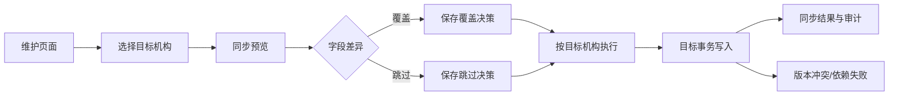

# 跨机构配置同步设计

## 1. 背景与目标

当前各门店通常使用相同或相近的商品、供应商、会员等级和会员商品销售政策，但维护数据分散在各机构。管理员需要重复录入，容易出现编码不一致、政策档位遗漏和门店配置漂移。

本功能提供“同步到其他机构”能力：管理员从当前机构维护页面选择其有权限管理的目标机构，系统先生成差异预览，再由管理员逐条选择覆盖或跳过，最后按目标机构执行复制。同步不改变财务销售记录，不改变已经生成的会员购买单和政策快照。

## 2. 范围

### 2.1 本期范围

- 商品配置同步。
- 供应商配置同步。
- 会员等级配置同步。
- 会员商品销售政策及套餐档位同步。
- 目标机构选择、差异预览、覆盖/跳过、结果查询和同步审计。
- 权限、租户、机构范围、幂等和并发校验。

### 2.2 不在本期范围

- 跨机构共享同一份实时主数据。
- 自动删除目标机构多出来的配置。
- 自动覆盖目标机构已有配置。
- 财务历史销售数据迁移。
- 已生成会员购买单的政策重新计算。
- 以模板中心替代机构复制。

## 3. 业务规则

### 3.1 来源和目标机构

- 来源机构是当前工作机构。
- 目标机构只能从后端返回的当前用户可管理机构中选择。
- 当前用户必须同时具备对应业务的维护权限和跨机构同步权限。
- 所有读取、预览和写入都必须校验当前租户及机构范围；前端隐藏按钮不构成授权。
- 来源机构不能作为目标机构重复同步。

### 3.2 匹配规则

同步按稳定业务编码匹配，不使用数据库主键跨机构复用。

| 对象 | 匹配键 | 依赖 |
|---|---|---|
| 商品 | 商品编码 | 分类、单位等引用按目标机构解析 |
| 供应商 | 供应商编码 | 无 |
| 会员等级 | 等级编码 | 无 |
| 会员销售政策 | 目标周期 + 商品编码 + 政策编码 | 商品、会员等级、核算周期 |

编码必须保持在目标机构内唯一。目标机构不存在匹配编码时进入“新增”，存在且字段不同则进入“差异”，字段完全相同时进入“无需处理”。

### 3.3 政策依赖

- 政策同步必须明确目标核算周期。
- 目标机构没有对应周期时，预览阶段返回阻塞原因，不允许静默写入来源周期 ID。
- 目标商品或会员等级不存在时，政策明细进入失败明细；管理员需先同步依赖后重新预览。
- 政策同步固化当前政策版本和套餐档位；历史会员购买单继续使用自己的政策快照。

### 3.4 差异处理

- 新增项默认选中“新增”。
- 已存在差异项默认不选择，必须由管理员明确选择“覆盖”或“跳过”。
- 字段差异展示旧值、新值和字段名称。
- “跳过”不修改目标数据，但记录操作结果。
- 本期不提供删除选项。

### 3.5 执行和幂等

- 每次预览生成同步批次号和预览版本。
- 执行请求必须携带批次号、预览版本、目标机构和明细处理决策。
- 同一批次、同一目标机构、同一预览版本重复提交返回原执行结果，不重复写入。
- 多目标机构按目标机构分别执行；一个目标机构失败不回滚其他已完成目标机构。
- 单个目标机构内部按依赖顺序执行，失败时该目标机构事务回滚。
- 执行前重新读取目标数据并校验版本；目标数据在预览后被其他人修改时，该明细进入“版本冲突”，不覆盖目标数据。

## 4. 方案架构

### 4.1 通用同步编排层

同步编排层负责：

1. 校验来源和目标机构权限；
2. 调用业务适配器生成标准化差异；
3. 保存批次、目标机构、差异和快照；
4. 接收逐条覆盖/跳过决策；
5. 按目标机构执行并记录结果。

通用层不直接拼装商品、供应商、等级或政策字段，业务规则由各自适配器负责。

### 4.2 业务适配器

- `PRODUCT`：复制商品基础资料和状态，使用商品编码匹配。
- `SUPPLIER`：复制供应商基础资料和状态，使用供应商编码匹配。
- `MEMBER_LEVEL`：复制等级编码、成长门槛、积分比例和权益配置。
- `MEMBER_POLICY`：解析目标周期、商品编码、等级和套餐档位后复制政策及版本内容。

每个适配器提供统一的预览、依赖检查、字段差异生成和执行接口，避免把四类业务的校验规则混入通用同步服务。

### 4.3 数据流

## 5. 数据设计

新增同步批次和同步明细两类记录，保留来源值、目标值和执行结果。

### 5.1 同步批次

建议字段：

- `batch_id`：同步批次主键。
- `tenant_id`：租户 ID。
- `source_dept_id`：来源机构。
- `sync_type`：`PRODUCT`、`SUPPLIER`、`MEMBER_LEVEL`、`MEMBER_POLICY`。
- `source_version`：来源预览版本。
- `status`：预览中、待执行、执行中、部分成功、成功、失败。
- `idempotency_key`：幂等键。
- `create_by`、`create_time`、`update_by`、`update_time`。

### 5.2 同步明细

建议字段：

- `detail_id`、`batch_id`、`target_dept_id`。
- `business_key`：对象业务匹配键。
- `source_record_id`、`target_record_id`：仅作审计引用，不跨机构复用。
- `operation`：新增、覆盖、跳过、无需处理、冲突、失败。
- `decision`：管理员选择的覆盖或跳过。
- `source_snapshot`、`target_snapshot`：执行前 JSON 快照。
- `diff_snapshot`：字段级差异 JSON。
- `source_row_version`、`target_row_version`：并发校验版本。
- `error_code`、`error_message`。
- `result_time`。

快照只用于审计和冲突判断，不作为绕过业务校验的写入来源。金额、数量和政策档位仍使用明确的数值类型及服务端校验。

## 6. 后端接口

建议新增统一接口：

- `POST /member/config-sync/preview`：生成多目标机构差异预览。
- `GET /member/config-sync/{batchId}`：查询批次及差异。
- `POST /member/config-sync/{batchId}/execute`：提交覆盖/跳过决策并执行。
- `GET /member/config-sync/list`：查询同步记录。
- `POST /member/config-sync/{batchId}/retry`：仅重试失败或版本冲突明细，重新预览后执行。

权限采用独立操作权限，不复用普通新增/修改权限：

- `finance:product:sync`。
- `finance:supplier:sync`。
- `member:level:sync`。
- `member:campaignPolicy:sync`。
- `member:configSync:query`。

服务端必须检查：租户、来源机构、目标机构、用户机构授权、业务维护权限、幂等键、目标行版本和依赖关系。

## 7. PC 端交互

商品、供应商、会员等级、会员商品销售政策维护页面分别增加“同步到其他机构”操作入口。

同步弹窗分三步：

1. 选择目标机构：显示机构名称、当前配置数量和可管理状态；
2. 差异预览：按新增、差异、无变化、依赖缺失分类，差异项展示字段级新旧值；
3. 执行结果：按机构展示成功、跳过、冲突、失败数量及错误原因。

当目标机构存在冲突时，必须逐条选择覆盖或跳过；未选择的差异项不能执行。页面切换或刷新后可通过批次号恢复进度。

## 8. 错误处理和安全

- 未授权目标机构直接拒绝，不返回目标机构的敏感配置详情。
- 目标机构不存在依赖时返回可操作原因，例如“目标机构缺少商品 GEL-001”。
- 目标配置在预览后发生版本变化时拒绝覆盖，提示重新预览。
- 重复提交返回原结果，不产生重复编码或重复政策。
- 同步审计记录不可由普通维护接口修改或删除。
- 同步失败不返回原始 SQL、堆栈或内部连接错误。
- 多目标机构结果彼此隔离，单个目标失败不会掩盖其他目标结果。

## 9. 测试与验收

### 9.1 后端测试

- 只能选择当前用户有权限管理的目标机构。
- 跨租户和无机构权限请求被拒绝。
- 新增项正确生成目标机构数据。
- 已存在差异项可分别覆盖或跳过。
- 未选择处理决策的差异项不能执行。
- 预览后目标版本变化会产生版本冲突。
- 商品、供应商、等级和政策按业务编码匹配，不复用来源主键。
- 政策缺少目标周期、商品或等级时拒绝该明细。
- 多目标机构一个成功、一个失败时结果正确隔离。
- 重复幂等请求不会重复插入。
- 同步不改变会员购买快照和财务销售统计。

### 9.2 PC 端测试

- 四个维护页面均能打开同步入口。
- 目标机构选择只显示后端返回的可管理机构。
- 差异字段、覆盖/跳过选择和结果明细正确展示。
- 权限不足时入口隐藏且直接调用被后端拒绝。

### 9.3 DEV 验收

- 重复执行 DDL 和菜单脚本不报错、不重复创建菜单。
- 服务启动并完成 Nacos 注册。
- 使用有效登录会话验证新增、覆盖、跳过、冲突、失败和审计查询。
- 验证会员购买历史仍保持原政策快照。

## 10. 发布策略

1. 先部署同步表结构和权限菜单。
2. 部署后端只读预览接口，验证权限和差异计算。
3. 部署执行接口，先开放商品和供应商同步。
4. 验证稳定后开放会员等级和会员销售政策同步。
5. 首批只允许管理员使用，保留同步批次和失败明细。
6. 出现异常时暂停同步权限，不修改已有业务数据；必要时按同步明细快照执行人工回滚。
