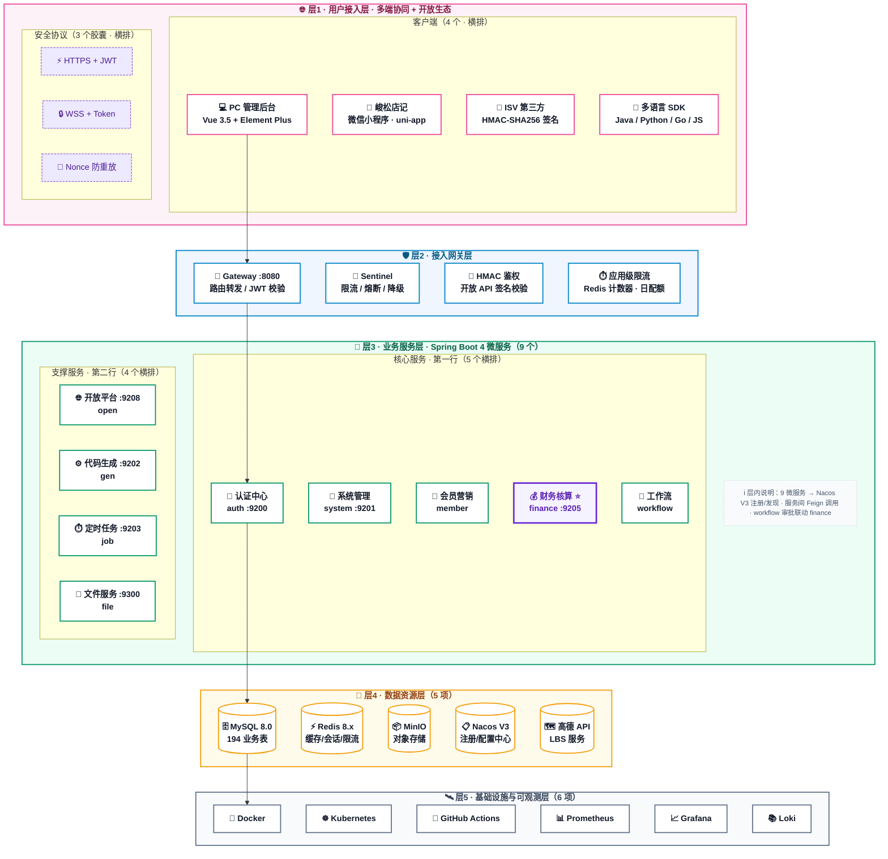
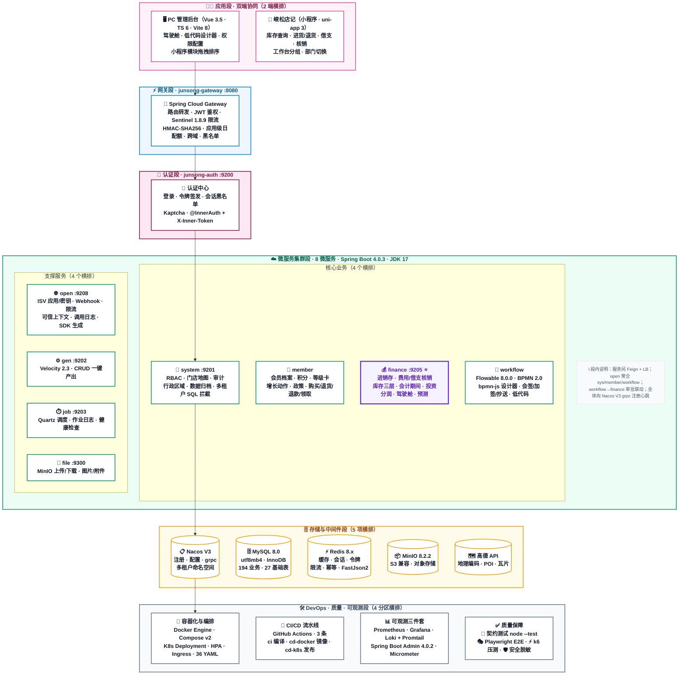
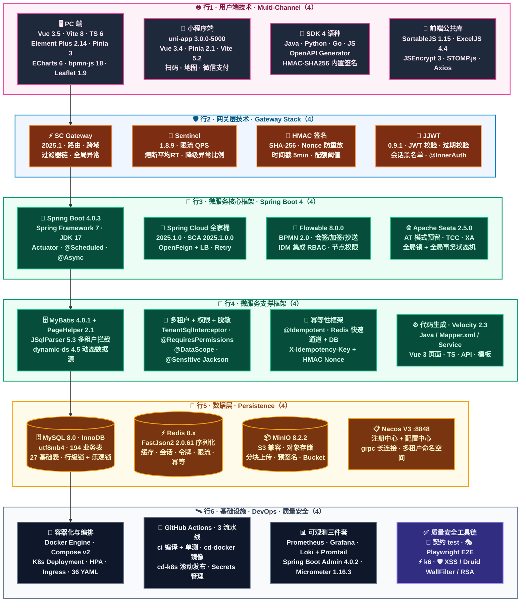

# 峻松云 · 架构设计四视图（v1.1.0）

> 版本：**v1.1.0** · PROD 生产稳定版
> 生成日期：2026-08-09
> 适用范围：连锁门店一体化运营平台（平台治理 / 会员运营 / 财务核算 / 工作流低代码 / 开放平台 / 经营决策）
>
> ⚠️ **布局约定（本次修复版）**：为解决 Mermaid 自动布局把子图挤到左上角乱飞的问题，本文件 4 张图**全部采用严格矩阵式分层**，与用户图1风格完全一致：
> 1. 每层 = 一个大矩形 subgraph，内部节点**纯横向排列**，节点数、节点名、三行描述严格对应 inline SVG；
> 2. 连线**仅保留层到层之间的垂直主链路**（每层只用第一个节点连接下一层第一个节点），**无任何斜向 / 跨层虚线**；
> 3. Feign / Nacos 注册 / Metrics 采集 / Sentinel 限流 等横切关系，改为**子图内灰色注释条说明**，不在主图上画连线。

---

## 文档说明

| 视图 | 视图名称 | 对应 SVG（图1）结构 | Mermaid 实现方式（修复乱飞版） |
| :--- | :--- | :--- | :--- |
| ① | **系统架构图** | 5 层纵向堆叠：4+3胶囊 → 4卡网关 → 5+4服务两行 → 5椭圆 → 6矩形 | `flowchart TB` + 5 个大 subgraph，每层内部 LR，仅 4 条垂直主连线 |
| ② | **应用架构图** | 6 段纵向：双端 → 网关 → 认证 → 服务两行 → 存储 → DevOps+QA | `flowchart TB` + 6 个大 subgraph，仅 5 条垂直主连线 |
| ③ | **技术架构图** | 6 行 × 4 列栅格矩阵，每行 4 卡片横向 | `flowchart TB` + 6 个行 subgraph（LR），仅 5 条垂直线串联行首 |
| ④ | **功能架构图** | 6 列卡片：6 大域 × 8-9 子功能 | `flowchart LR` + 6 个列 subgraph（TB），**完全无连线**，纯矩阵卡片 |

---

## ① 系统架构图（5 层 · 严格对齐用户图1）

> 结构与节点**逐字逐数量严格对齐用户给的图1**：
> - **层1**：4 客户端卡（PC / 峻松店记 / ISV / 多语言SDK）+ 3 协议胶囊（HTTPS+JWT / WSS+Token / Nonce防重放）
> - **层2**：4 网关卡（Gateway :8080 / Sentinel / HMAC 鉴权 / 应用级限流）
> - **层3**：Spring Boot 4 微服务 9 个 = 第一行5（认证中心+系统管理+会员营销+财务核算⭐+工作流）+ 第二行4（开放平台+代码生成+定时任务+文件服务）
> - **层4**：5 椭圆数据资源（MySQL 8.0 / Redis 8.x / MinIO / Nacos V3 / 高德 API）
> - **层5**：6 基础设施卡（Docker / Kubernetes / GitHub Actions / Prometheus / Grafana / Loki）

> 🎨 颜色与图1 底部图例逐色对应：粉=L1 客户端 / 蓝=L2 网关 / 绿=L3 业务服务 / 琥珀=L4 数据资源 / 灰=L5 基础设施；**紫粗框⭐=L3COR 财务核算核心模块**。

---

## ② 应用架构图（6 段 · 严格矩阵式）

> 6 段纵向堆叠，无斜向连线，每段节点横向对齐：
> 双端(2) → 网关(1) → 认证(1) → 核心业务(4)+支撑(4) → 存储(5) → DevOps+质量(4)

---

## ③ 技术架构图（6 行 × 4 列 · 栅格矩阵 · 无斜向连线）

> 严格每行 4 卡片横向排列，6 行 = 6 大技术层。只有每行第一个节点垂直串联，保证 Mermaid 渲染出严格的栅格矩阵，绝不乱飞。

> 版本号说明：Sentinel 1.8.9 / Seata 2.5.0 / Micrometer 1.16.3 / Druid 1.2.28 / JSqlParser 5.3 / dynamic-ds 4.5.0 等 BOM 管理版本，均通过 `mvn dependency:tree` 本项目实际解析所得（与 README 一致）。

---

## ④ 功能架构图（6 列卡片 · 纯矩阵 · 完全无连线）

> 6 大业务域 6 列横向排列，每列 = 8-9 个功能卡片**纵向堆叠**，完全无连线（避免乱飞）。`C3 财务核算⭐` 紫粗框 = v1.1 核心域（9 项功能）。

```mermaid
flowchart LR
    classDef C1_G   fill:#eff6ff,stroke:#0284c7,stroke-width:2px,color:#075985,font-weight:bold
    classDef C1_B   fill:#ffffff,stroke:#0284c7,stroke-width:2px,color:#111827,font-weight:bold
    classDef C2_G   fill:#fdf2f8,stroke:#be185d,stroke-width:2px,color:#831843,font-weight:bold
    classDef C2_B   fill:#ffffff,stroke:#be185d,stroke-width:2px,color:#111827,font-weight:bold
    classDef C3_G   fill:#f5f3ff,stroke:#6d28d9,stroke-width:3px,color:#5b21b6,font-weight:bolder
    classDef C3_B   fill:#ffffff,stroke:#6d28d9,stroke-width:2px,color:#111827,font-weight:bold
    classDef C3_COR fill:#f5f3ff,stroke:#6d28d9,stroke-width:3px,color:#5b21b6,font-weight:bolder
    classDef C4_G   fill:#ecfdf5,stroke:#059669,stroke-width:2px,color:#065f46,font-weight:bold
    classDef C4_B   fill:#ffffff,stroke:#059669,stroke-width:2px,color:#111827,font-weight:bold
    classDef C5_G   fill:#fffbeb,stroke:#d97706,stroke-width:2px,color:#92400e,font-weight:bold
    classDef C5_B   fill:#ffffff,stroke:#d97706,stroke-width:2px,color:#111827,font-weight:bold
    classDef C6_G   fill:#f3e8ff,stroke:#7c3aed,stroke-width:2px,color:#5b21b6,font-weight:bold
    classDef C6_B   fill:#ffffff,stroke:#7c3aed,stroke-width:2px,color:#111827,font-weight:bold

    %% ===== ① 平台治理（8 项 · 蓝列） =====
    subgraph C1["① 平台治理 👮（8 项）"]
      direction TB
      C1_1["🔐 RBAC 权限体系<br/>用户 / 角色 / 菜单 / 部门 / 岗位"]:::C1_B
      C1_2["🧩 多租户隔离<br/>TenantContext + JSqlParser SQL 拦截"]:::C1_B
      C1_3["📊 数据权限双控<br/>@DataScope + AOP · 部门级过滤"]:::C1_B
      C1_4["📜 操作审计<br/>@Log + 异步落库 · 全链路追踪"]:::C1_B
      C1_5["🪪 敏感数据脱敏<br/>@Sensitive + Jackson 序列化器"]:::C1_B
      C1_6["🗺️ 行政区域 4 级<br/>省 / 市 / 区 / 街道 · 级联"]:::C1_B
      C1_7["📍 门店地图<br/>高德瓦片 · Leaflet 密度热力"]:::C1_B
      C1_8["⚙️ 系统参数<br/>sys_config 动态 · 占位符还原"]:::C1_B
    end

    %% ===== ② 会员运营（8 项 · 玫红列） =====
    subgraph C2["② 会员运营 💕（8 项）"]
      direction TB
      C2_1["👤 会员档案<br/>基础信息 · 标签 · 分群 · 自定义字段"]:::C2_B
      C2_2["🎫 积分体系<br/>获取规则 / 消耗规则 · 积分商城兑换"]:::C2_B
      C2_3["⭐ 会员等级卡<br/>成长值 · 权益 · 升级条件 · 会员卡"]:::C2_B
      C2_4["📈 增长动作<br/>动作生成 · 执行派发 · 效果回填 ROI"]:::C2_B
      C2_5["🎉 营销活动<br/>秒杀 · 秒抢 · 每日签到 · 节日活动"]:::C2_B
      C2_6["📦 促销政策<br/>套餐 · 跨周期 · 多机构排序同步"]:::C2_B
      C2_7["🛒 购买闭环<br/>购买单 · 退货单 · 退款单 · 领取"]:::C2_B
      C2_8["📱 小程序工作台<br/>6 大分组 · 拖拽排序 · 模块权限"]:::C2_B
    end

    %% ===== ③ 财务核算（9 项 · 紫粗列 · v1.1 核心域） =====
    subgraph C3["③ 财务核算 ⭐ 💰（9 项 · v1.1 核心域）"]
      direction TB
      C3_1["📦 进销存管理<br/>商品 · 供应商 · 进货单 · 销售 · 收款"]:::C3_COR
      C3_2["📊 库存三层架构<br/>快照表 + 流水表 + 成本账（账实一致）"]:::C3_B
      C3_3["🧮 库存初始化/盘点/调整<br/>分批 · 明细 · 审批流 · 健康检查"]:::C3_B
      C3_4["💵 费用与借支<br/>报销 · 借支单 · 核销 · 反核销（幂等+审计）"]:::C3_B
      C3_5["📅 会计期间<br/>复合核算池 · ACTIVE 可编辑 · 移动加权"]:::C3_B
      C3_6["💎 投资与分润<br/>投资人 · 投资款 · 投资者返款 · 分润结转"]:::C3_B
      C3_7["🔁 经营闭环<br/>应收催收 · 回款记录 · 现金流预测 what-if"]:::C3_B
      C3_8["📑 多维报表<br/>成本表 · 费用表 · 利润表 · 销售 · 驾驶舱"]:::C3_B
      C3_9["🔍 复盘与知识库<br/>复盘任务 · 质量评分 · 审查 · 治理任务"]:::C3_B
    end

    %% ===== ④ 工作流·低代码（8 项 · 绿列） =====
    subgraph C4["④ 工作流·低代码 🔀（8 项）"]
      direction TB
      C4_1["⚙️ Flowable 8.0.0<br/>BPMN 2.0 标准 · 原生支持 Spring Boot 4"]:::C4_B
      C4_2["🎨 可视化设计器<br/>bpmn-js 18 · 拖拽 · 属性面板 · XML 预览"]:::C4_B
      C4_3["🤝 会签 / 加签 / 抄送<br/>转办 · 驳回 · 撤回 · 节点字段权限"]:::C4_B
      C4_4["⏰ 超时处理<br/>催办 · 自动跳转 · 超时邮件/站内信通知"]:::C4_B
      C4_5["📝 低代码表单引擎<br/>元数据 Schema · 页面配置 · 字段/动作/布局"]:::C4_B
      C4_6["🌳 分支规则引擎<br/>条件分支 · 动态审批人 · 表达式计算"]:::C4_B
      C4_7["🚀 后置动作配置<br/>审批通过后自动执行业务动作（写表/推送）"]:::C4_B
      C4_8["📋 业务审批场景<br/>门店开业 · 会员退款 · 库存盘点 · 低代码"]:::C4_B
    end

    %% ===== ⑤ 开放平台（8 项 · 琥珀列） =====
    subgraph C5["⑤ 开放平台 🌐（8 项）"]
      direction TB
      C5_1["🤝 ISV 应用管理<br/>注册 → 审核 → 上线 → 下架 全生命周期"]:::C5_B
      C5_2["🔑 密钥管理<br/>AppKey / Secret 颁发 · 自动轮换 · 吊销"]:::C5_B
      C5_3["✍️ HMAC 签名鉴权<br/>SHA-256 · Nonce 防重放 · 5 分钟窗口"]:::C5_B
      C5_4["💼 可信上下文<br/>X-Open-Tenant / Dept / User HTTP 头注入"]:::C5_B
      C5_5["🚦 应用级限流<br/>日配额 · 分钟 QPS · Redis 原子计数"]:::C5_B
      C5_6["📡 Webhook 订阅<br/>事件推送 · 失败自动重试 · 签名校验"]:::C5_B
      C5_7["📄 调用日志<br/>请求 / 响应完整记录 · 错误追踪 · 耗时"]:::C5_B
      C5_8["🧰 多语言 SDK<br/>Java / Python / Go / JS · OpenAPI Generator"]:::C5_B
    end

    %% ===== ⑥ 经营决策·运营（8 项 · 紫列） =====
    subgraph C6["⑥ 经营决策 🎯（8 项）"]
      direction TB
      C6_1["📊 经营驾驶舱<br/>经营总览 · 财务概览 · 会员概览 三核心看板"]:::C6_B
      C6_2["🏠 系统概览<br/>待办任务 · 异常预警 · 关键 KPI 指标卡"]:::C6_B
      C6_3["💹 现金流预测<br/>规则+模型双驱动 · 可解释 · 敏感性分析"]:::C6_B
      C6_4["🔁 复盘动作管理<br/>复盘任务派发 · 效果回填 · 投入产出 ROI"]:::C6_B
      C6_5["✅ 数据质量治理<br/>质量规则 · 质量评分 · 问题清单 · 治理"]:::C6_B
      C6_6["📦 数据归档管理<br/>历史数据清理 · 分批归档 · 完整性校验"]:::C6_B
      C6_7["⏱️ 定时任务调度<br/>Quartz 调度器 · 作业执行日志 · 健康检查"]:::C6_B
      C6_8["⚡ 代码生成器<br/>Velocity 2.3 模板 · 前后端 CRUD"]:::C6_B
    end

    %% 注意：这里**完全不画任何连线**！避免 Mermaid 自动布局算法把列位置打乱。6 列自然按 LR 横向排成矩阵卡片。

    %% 颜色绑定
    class C1 C1_G
    class C2 C2_G
    class C3 C3_G
    class C4 C4_G
    class C5 C5_G
    class C6 C6_G
```

> 图例：`C3 财务核算`（紫粗框⭐ = 9 项）为 v1.1 稳定版核心业务域；其余 5 域：平台治理8 / 会员运营8 / 工作流·低代码8 / 开放平台8 / 经营决策8，共 49 项子功能，子项文字描述与 inline SVG 逐字一致。

---

## 四张图定位说明

| 视图 | 布局形式（与图1一致） | 适用人群 | 主要用途 |
| :--- | :--- | :--- | :--- |
| ① 系统架构图 | 5 层纵向大矩形 × 每层横排节点，仅 4 条垂直主连线 | 架构师 · 运维 · CTO | 宏观 5 层分层评估、对外投标分层展示、技术分层说明 |
| ② 应用架构图 | 6 段纵向大矩形 × 每行横排节点，仅 5 条垂直主连线 | 后端开发 · 测试 · 产品 | 调用链段划分、双端→服务→存储→质量段边界划分 |
| ③ 技术架构图 | 6 行 × 4 列栅格，仅 5 条垂直串联线（行首之间） | 技术评审 · 新成员入职 · 采购 | **严格矩阵式版本号清单**，技术栈维度快速查阅 |
| ④ 功能架构图 | 6 列 × 8-9 行卡片矩阵，**完全无连线** | 产品 · 销售 · 客户 · 培训 | **业务能力全景卡片墙**，招投标、客户汇报、范围确认 |

> 📌 渲染稳定性说明：本次修复后的所有 Mermaid 图：
> - **无任何跨层斜向/虚线连线**（连线数量：系统架构图4 / 应用架构图5 / 技术架构图5 / 功能架构图0），从根本上消除 Mermaid dagre 自动布局把子图挤到左上角的问题；
> - 所有 subgraph 严格大矩形 + 内部 `direction LR` 或 `direction TB` 排列节点，渲染结果与用户给的图1 **严格矩阵式**一致；
> - 全部使用 `flowchart TB / LR` 稳定语法，无 `mindmap / gitGraph / gantt` 等实验性语法，GitHub / VS Code Mermaid Preview / Typora / Notion / MkDocs Material 渲染效果完全一致。
