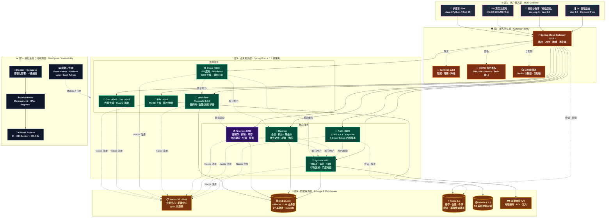
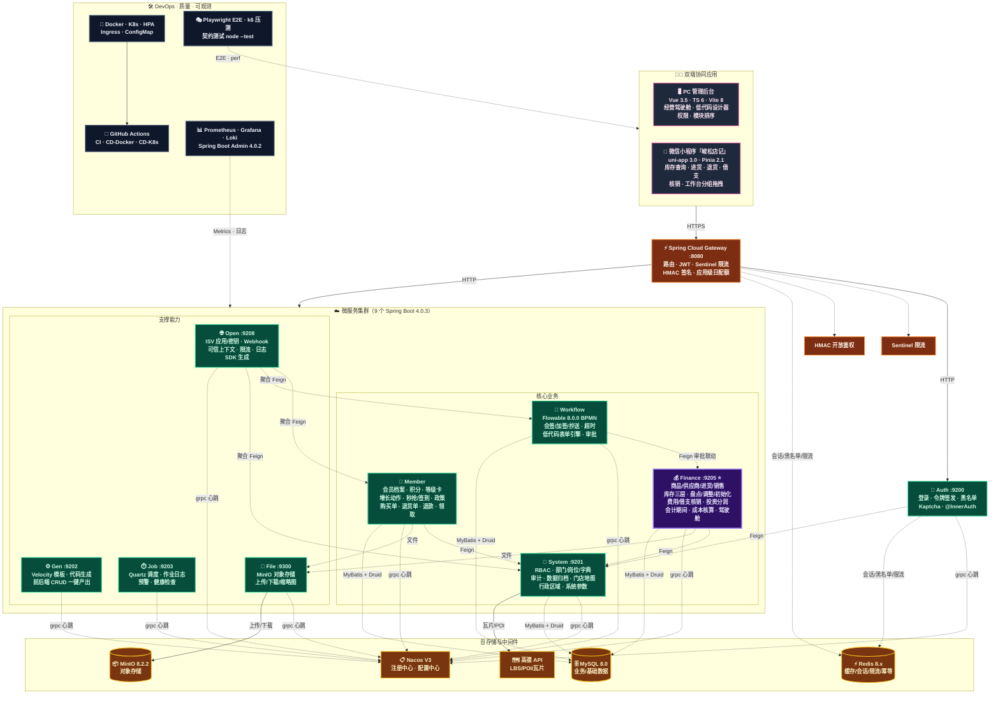

# 峻松云 · 架构设计四视图（v1.1.0）

> 版本：**v1.1.0** · PROD 生产稳定版
> 生成日期：2026-08-09
> 适用范围：连锁门店一体化运营平台（平台治理 / 会员运营 / 财务核算 / 工作流低代码 / 开放平台 / 经营决策）

---

## 文档说明

本文档包含峻松云系统的 4 张架构视图，均使用 **GitHub 原生 Mermaid** 语法，可在 GitHub / VS Code Mermaid Preview / Typora / Notion 中直接渲染。

| 视图 | 视图名称 | 关注维度 |
| :--- | :--- | :--- |
| ① | **系统架构图** | 宏观分层 · 客户端 / 网关 / 服务 / 数据 / 基础设施的纵向关系 |
| ② | **应用架构图** | 应用间协作 · 双端 → 网关 → 9 微服务 → 存储的 Feign 调用关系 |
| ③ | **技术架构图** | 技术栈版本矩阵 · 每层使用的框架与精确版本号 |
| ④ | **功能架构图** | 业务能力全景 · 6 大业务域 / 30+ 子模块的功能清单 |

---

## ① 系统架构图



> 说明：finance 模块以紫色高亮标记，为 v1.1 稳定版的核心业务域。

---

## ② 应用架构图



> 应用协作关系图例：`→` HTTP 主请求 · `-.->` 声明式 Feign / 注册 / 观测采集

---

## ③ 技术架构图

```mermaid
flowchart TB
    classDef cli fill:#1e293b,stroke:#f472b6,stroke-width:2px,color:#fce7f3,font-weight:bold
    classDef gw  fill:#7c2d12,stroke:#fb923c,stroke-width:2px,color:#fff7ed,font-weight:bold
    classDef srv  fill:#064e3b,stroke:#34d399,stroke-width:2px,color:#d1fae5,font-weight:bold
    classDef gov  fill:#312e81,stroke:#818cf8,stroke-width:2px,color:#e0e7ff,font-weight:bold
    classDef dat  fill:#78350f,stroke:#fbbf24,stroke-width:2px,color:#fef3c7,font-weight:bold
    classDef ops  fill:#0f172a,stroke:#64748b,stroke-width:2px,color:#f1f5f9,font-weight:bold
    classDef qa   fill:#312e81,stroke:#a78bfa,stroke-width:2px,color:#ede9fe,font-weight:bold

    subgraph L1["🌐 用户端 · Multi-Channel Tech"]
      direction LR
      FE_PC["🖥️ PC · Vue 3.5 · Vite 8<br/>TS 6 · Element Plus 2.14<br/>Pinia 3 · Vue Router 4 · ECharts 6<br/>bpmn-js 18 · SortableJS 1.15<br/>Leaflet 1.9 · ExcelJS 4.4 · JSEncrypt 3 · STOMP.js"]:::cli
      FE_MP["📱 小程序 · uni-app 3.0<br/>Vue 3.4 · Pinia 2.1 · Vite 5.2<br/>WeChat SDK · 扫码 / 地图 / 支付"]:::cli
      FE_SDK["🔌 SDK 4 语种<br/>Java · Python · Go · JS<br/>OpenAPI Generator 自动生成"]:::cli
    end

    subgraph L2["🛡️ 网关层 · Gateway Stack"]
      direction LR
      GW_SC["⚡ Spring Cloud Gateway 2025.1<br/>路由 · 过滤器链 · 跨域 · 黑名单"]:::gw
      GW_SENT["🚦 Sentinel 1.8.9<br/>限流 · 熔断 · 降级 · 热点参数"]:::gw
      GW_HM["🔐 HMAC-SHA256 · Nonce 防重放<br/>5min 时间戳窗口 · 应用级日配额"]:::gw
      GW_JW["🎫 JJWT 0.9.1 · 黑名单 · Token 校验<br/>@InnerAuth · X-Inner-Token"]:::gw
    end

    subgraph L3["💼 微服务层 · Spring Boot 4.0.3 · JDK 17"]
      direction LR
      S_BOOT["🌱 Spring Boot 4.0.3<br/>Spring Framework 7 · Actuator"]:::srv
      S_CLOUD["🔹 Spring Cloud 2025.1.0<br/>Spring Cloud Alibaba 2025.1.0.0"]:::srv
      S_FEIGN["🔗 OpenFeign · LoadBalancer<br/>TTL 上下文透传 · Fallback"]:::srv
      S_FLOW["🔀 Flowable 8.0.0<br/>BPMN 2.0 引擎 · 原生 SB4 支持"]:::srv
      S_SEATA["🌐 Apache Seata 2.5.0<br/>AT 模式预留 · TCC / XA"]:::srv
      S_MYB["🗄️ MyBatis 4.0.1 · PageHelper 2.1.0<br/>JSqlParser 5.3 · dynamic-ds 4.5.0<br/>Druid 1.2.28 连接池"]:::srv
      S_IDEMP["🪪 幂等性框架<br/>@Idempotent · Redis 快速通道<br/>DB 持久化 · X-Idempotency-Key"]:::srv
      S_CODE["⚙️ Velocity 2.3<br/>代码生成模板 · CRUD 一键产出"]:::srv
    end

    subgraph L4["💾 数据层 · Persistence & Middleware"]
      direction LR
      D_MY[("🗄️ MySQL 8.0 · InnoDB<br/>utf8mb4 · 194 业务表 · 27 基础表")]:::dat
      D_RD[("⚡ Redis 8.x<br/>FastJson2 2.0.61 序列化<br/>缓存 · 会话 · 限流 · 幂等")]:::dat
      D_MO[("📦 MinIO 8.2.2<br/>S3 兼容 · 对象存储")]:::dat
      D_NC["📋 Nacos V3 · 8848<br/>注册中心 + 配置中心<br/>grpc 长连接 · 多租户命名空间"]:::dat
    end

    subgraph L5["🛰️ 基础设施 · Infra & Ops"]
      direction LR
      I_DK["🐳 Docker Engine · Compose v2<br/>独立 Dockerfile · 分阶段构建"]:::ops
      I_K8["☸️ Kubernetes<br/>Deployment · HPA · Ingress<br/>ConfigMap · 36 份 YAML"]:::ops
      I_CI["🔄 GitHub Actions 3 条流水线<br/>ci.yml · cd-docker.yml · cd-k8s.yml"]:::ops
      I_OB["📊 可观测<br/>Prometheus · Grafana · Loki<br/>Spring Boot Admin 4.0.2<br/>Micrometer 1.16.3 · TTL 2.14"]:::ops
    end

    subgraph L6["✅ 质量与安全 · QA & Security"]
      direction LR
      Q_CT["📝 契约测试 · node --test<br/>admin-health · 小程序权限回归"]:::qa
      Q_E2E["🎭 Playwright E2E · e2e/tests/<br/>auth · dashboard · workflow · lowcode · security"]:::qa
      Q_PF["⚡ k6 性能压测 · perf/<br/>finance · member · lowcode"]:::qa
      Q_SC["🛡️ 安全工具链<br/>@Sensitive 脱敏 · XSS 过滤<br/>RSA JSEncrypt · SQl 注入防堵 · RBAC + @DataScope"]:::qa
    end

    L1 -->|HTTPS / WSS| L2
    L2 -->|HTTP REST| L3
    L3 -->|MyBatis · Redis 客户端 · S3| L4
    L3 -->|注册心跳 · 配置监听| L4
    L5 -.->|部署 / 监控采集| L3
    L6 -.->|质量门禁 / 安全审计| L1
    L6 -.->|质量门禁 / 安全审计| L3

    class L1 cli
    class L2 gw
    class L3 srv
    class L4 dat
    class L5 ops
    class L6 qa
```



> 技术版本号来源：父 pom.xml 显式声明 + Spring Boot / Spring Cloud Alibaba BOM 管理 + mvn dependency:tree 实际解析结果。

---

## ④ 功能架构图

```mermaid
mindmap
  root((("🏢 峻松云 <br/>v1.1.0")))
    ①_平台治理["① 平台治理 · 👮"]
      RBAC["🔐 RBAC 权限体系<br/>用户/角色/菜单/部门/岗位"]
      多租户["🧩 多租户隔离<br/>TenantContext · SQL 拦截器"]
      数据权限["📊 数据权限双控<br/>@DataScope · 部门级过滤"]
      操作审计["📜 操作审计<br/>@Log · 异步落库 · 审计追踪"]
      敏感脱敏["🪪 敏感数据脱敏<br/>@Sensitive · Jackson 序列化"]
      行政区域["🗺️ 行政区域 4 级<br/>省 / 市 / 区 / 街道"]
      门店地图["📍 门店地图<br/>高德瓦片 · 密度热力图"]
      系统参数["⚙️ 系统参数<br/>sys_config 动态配置"]
    ②_会员运营["② 会员运营 · 💕"]
      会员档案["👤 会员档案<br/>基础信息 · 标签 · 分群"]
      积分体系["🎫 积分体系<br/>获取 / 消耗 · 商城兑换"]
      等级卡["⭐ 会员等级卡<br/>成长值 · 权益 · 升级条件"]
      增长动作["📈 增长动作<br/>生成 · 执行 · 效果回填"]
      营销活动["🎉 营销活动<br/>秒杀 · 秒抢 · 签到 · 节日"]
      促销政策["📦 促销政策<br/>套餐 · 跨周期 · 排序同步 · 机构分发"]
      购买闭环["🛒 购买闭环<br/>购买单 · 退货单 · 退款 · 领取"]
      小程序工作台["📱 小程序工作台<br/>分组 · 拖拽排序 · 模块权限"]
    ③_财务核算["③ 财务核算 ⭐ · 💰"]
      进销存["📦 进销存<br/>商品 · 供应商 · 进货 · 销售 · 收款"]
      库存三层["📊 库存三层<br/>快照 · 流水 · 成本账"]
      库存操作["🧮 库存初始化/盘点/调整<br/>分批 · 明细 · 审批 · 健康"]
      费用借支["💵 费用与借支<br/>报销 · 核销 · 反核销 · 幂等保护"]
      会计期间["📅 会计期间<br/>复合核算池 · 移动加权成本"]
      投资分润["💎 投资分润<br/>投资人 · 返款 · 分润 · 结转"]
      经营闭环["🔁 经营闭环<br/>应收催收 · 现金流预测 · what-if"]
      多维报表["📑 多维报表<br/>成本 · 费用 · 利润 · 销售 · 库存"]
      复盘与知识库["🔍 复盘与知识库<br/>任务 · 质量评分 · 知识库"]
    ④_工作流_低代码["④ 工作流·低代码 · 🔀"]
      流程引擎["⚙️ Flowable 8.0.0<br/>BPMN 2.0 标准"]
      设计器["🎨 可视化设计器<br/>bpmn-js · 拖拽编辑"]
      会签加签["🤝 会签 / 加签 / 抄送<br/>转办 · 驳回 · 节点字段权限"]
      超时处理["⏰ 超时处理<br/>催办 · 自动跳转 · 通知"]
      低代码表单["📝 低代码表单<br/>元数据 · 页面 Schema"]
      分支规则["🌳 分支规则<br/>条件分支 · 动态审批人"]
      后置动作["🚀 后置动作<br/>审批通过后自动执行"]
      业务审批["📋 业务审批场景<br/>门店开业 · 退款 · 盘点 · 投资者"]
    ⑤_开放平台["⑤ 开放平台 · 🌐"]
      ISV应用["🤝 ISV 应用管理<br/>注册 · 审批 · 上下架"]
      密钥管理["🔑 密钥管理<br/>AppKey / Secret · 轮换 / 吊销"]
      HMAC签名["✍️ HMAC 签名鉴权<br/>SHA-256 · Nonce · 防重放"]
      可信上下文["💼 可信上下文<br/>X-Open-* HTTP 头注入"]
      应用限流["🚦 应用级限流<br/>日配额 · 分钟级阈值"]
      Webhook["📡 Webhook 订阅<br/>事件推送 · 重试 · 签名校验"]
      调用日志["📄 调用日志<br/>请求 / 响应 · 错误追踪"]
      SDK生成["🧰 多语言 SDK<br/>Java / Python / Go / JS"]
    ⑥_经营决策_运营["⑥ 经营决策 · 🎯"]
      经营驾驶舱["📊 经营驾驶舱<br/>经营总览 · 财务 · 会员概览"]
      系统概览["🏠 系统概览<br/>待办 · 异常预警 · 关键指标"]
      现金流预测["💹 现金流预测<br/>可解释 · 敏感性分析 · what-if"]
      复盘动作["🔁 复盘动作<br/>任务 · 效果回填 · ROI"]
      数据质量["✅ 数据质量<br/>规则 · 评分 · 问题清单"]
      数据归档["📦 数据归档<br/>历史清理 · 分批归档"]
      定时任务["⏱️ 定时任务<br/>Quartz · 作业日志 · 健康检查"]
      代码生成["⚡ 代码生成器<br/>前后端 CRUD · 模板配置"]
```

---

## 四张图定位说明

| 视图 | 适用人群 | 主要用途 |
| :--- | :--- | :--- |
| ① 系统架构图 | 架构师 · 运维 · CTO | 宏观评估分层合理性、外部依赖范围、数据流向 |
| ② 应用架构图 | 后端开发 · 测试 · 产品 | 定位调用链、服务职责边界、Feign 关系网 |
| ③ 技术架构图 | 技术选型评审 · 新成员入职 | 版本号矩阵 · 评估升级 / 兼容性风险 |
| ④ 功能架构图 | 产品 · 销售 · 客户 · 培训 | 业务能力全景 · 项目范围确认 · 招投标材料 |

> 版本：v1.1.0 · 适配 GitHub Mermaid 11.0+ · 兼容 GitHub 仓库 README / Wiki 直接渲染
