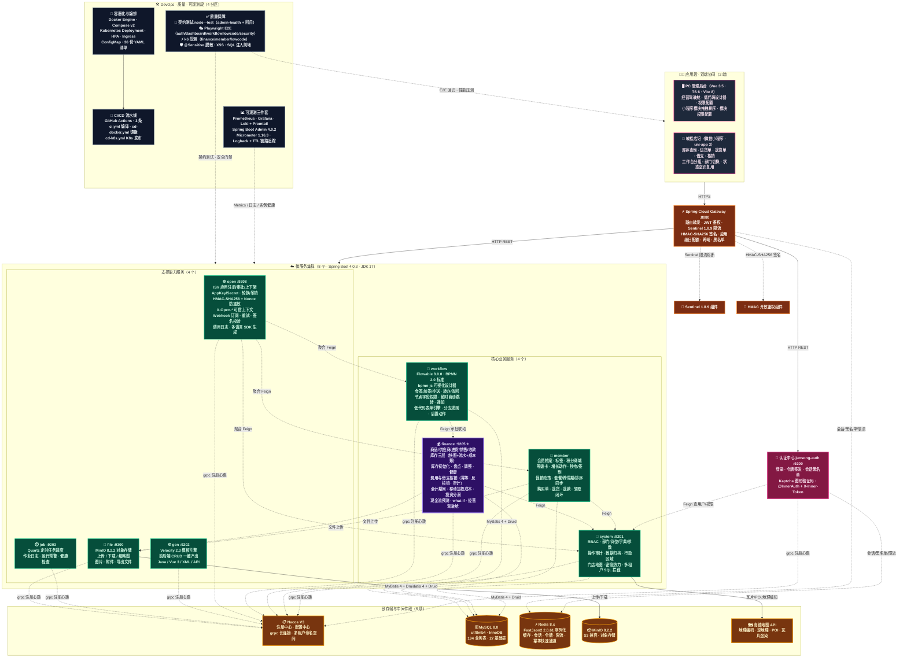
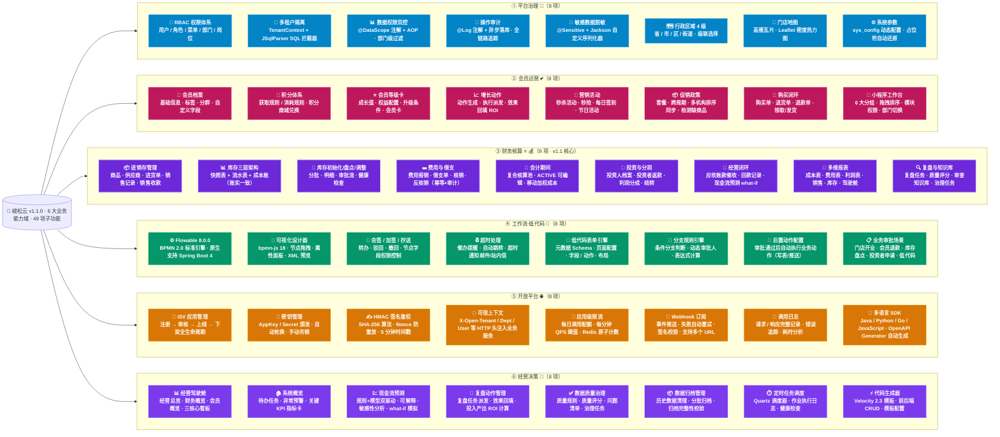

# 峻松云 · 架构设计四视图（v1.1.0）

> 版本：**v1.1.0** · PROD 生产稳定版
> 生成日期：2026-08-09
> 适用范围：连锁门店一体化运营平台（平台治理 / 会员运营 / 财务核算 / 工作流低代码 / 开放平台 / 经营决策）
>
> ⚠️ 约定：本文档中 4 张 Mermaid 图的**层次划分 · 节点命名 · 版本号 · 端口 · 服务三行描述 · 功能子项 · 颜色主题**，与对话中 `PureShowWidget` inline SVG 渲染的 4 张架构图**1:1 严格对齐**，无遗漏、无重组。

---

## 文档说明

| 视图 | 视图名称 | 对应 inline SVG 结构 | Mermaid 实现方式 |
| :--- | :--- | :--- | :--- |
| ① | **系统架构图** | 5 层纵向堆叠（客户端→网关→服务→数据→基础设施），每行横向多节点 | `flowchart TB` + 每层 `subgraph direction LR` |
| ② | **应用架构图** | 6 段纵向（客户端/网关/认证/服务2行/存储/DevOps + QA），Feign/注册/观测连线 | `flowchart TB` + 6 `subgraph` |
| ③ | **技术架构图** | 6 行 × 4 列栅格矩阵（端/网关/服务×2行/数据/基础设施/质量安全），全版本号 | `flowchart TB` + 每行 `subgraph LR` 4 节点 |
| ④ | **功能架构图** | 6 列卡片布局（6 大业务域，每列 8-9 个子功能） | `flowchart LR` + 6 列纵向 `subgraph` |

---

## ① 系统架构图（5 层 · 对应 SVG）

> 严格对应：**L5 基础设施 6 节点 / L4 数据资源 5 椭圆 / L3 业务服务（4+4+Auth） / L2 网关 4 卡片 + 3 协议胶囊 / L1 用户接入 4 客户端**

```mermaid
flowchart TB
    classDef L5   fill:#0f172a,stroke:#64748b,stroke-width:2px,color:#f1f5f9,font-weight:bold
    classDef L4   fill:#78350f,stroke:#f59e0b,stroke-width:2px,color:#fef3c7,font-weight:bold
    classDef L3   fill:#064e3b,stroke:#10b981,stroke-width:2px,color:#d1fae5,font-weight:bold
    classDef L3F  fill:#2e1065,stroke:#a78bfa,stroke-width:3px,color:#ede9fe,font-weight:bolder
    classDef L3A  fill:#831843,stroke:#ec4899,stroke-width:2px,color:#fce7f3,font-weight:bold
    classDef L2   fill:#7c2d12,stroke:#fb923c,stroke-width:2px,color:#fff7ed,font-weight:bold
    classDef L1   fill:#1e293b,stroke:#ec4899,stroke-width:2px,color:#fce7f3,font-weight:bold
    classDef TAG  fill:#ede9fe,stroke:#6d28d9,stroke-dasharray:4 2,color:#4c1d95,font-weight:500

    %% ===== 层5 基础设施层（对应 SVG 第 5 层 · 6 个卡片） =====
    subgraph L5G["🛰️ 层5 · 基础设施与可观测层（6 节点）"]
      direction LR
      DK["🐳 Docker<br/>容器化部署"]
      K8S["☸️ Kubernetes<br/>Deployment · HPA · Ingress"]
      CI["🔄 GitHub Actions<br/>CI 编译 · CD-Docker · CD-K8s<br/>3 条流水线"]
      PROM["📊 Prometheus<br/>JVM · HTTP 指标"]
      GRF["📈 Grafana<br/>可视化面板 · 告警规则"]
      LOKI["📚 Loki<br/>日志聚合 · 容器采集"]
    end

    %% ===== 层4 数据资源层（对应 SVG 第 4 层 · 5 个数据库 + Nacos 椭圆） =====
    subgraph L4G["💾 层4 · 数据资源层（5 项存储 + 中间件）"]
      direction LR
      MY[("🗄️ MySQL 8.0<br/>utf8mb4 · InnoDB<br/>194 业务表 · 27 基础表")]:::L4
      RD[("⚡ Redis 8.x<br/>缓存 · 会话 · 令牌<br/>限流 · 幂等快速通道")]:::L4
      MO[("📦 MinIO<br/>S3 兼容对象存储")]:::L4
      NC["📋 Nacos V3 · 8848<br/>服务注册发现 · 配置中心<br/>grpc 长连接 · 多租户命名空间"]
      AM["🗺️ 高德地图 API<br/>地理编码 · POI · 瓦片渲染"]
    end

    %% ===== 层3 业务服务层（对应 SVG 第 3 层 · Auth 单独小框 + 8 服务两行） =====
    subgraph L3G["💼 层3 · 业务服务层（9 微服务 · Spring Boot 4.0.3 · JDK 17）"]
      direction TB
      AUTH["🎫 认证中心 auth :9200<br/>JJWT 0.9.1 令牌 · Kaptcha<br/>@InnerAuth · X-Inner-Token · 黑名单"]:::L3A
      subgraph L3ROW1["核心业务（第一行 · 4 个）"]
        direction LR
        SYS["🏢 系统管理 system :9201<br/>RBAC · 门店地图 · 治理审计<br/>行政区域 · 数据归档 · 字典参数"]
        MEM["👥 会员营销 member<br/>档案 · 积分商城 · 等级卡<br/>增长动作 · 秒抢/签到 · 政策同步<br/>购买单 · 退货 · 退款 · 领取"]
        FIN["💰 财务核算 finance :9205 ⭐<br/>进销存 · 费用/借支核销<br/>库存三层（快照/流水/成本账）<br/>会计期间 · 投资分润 · 驾驶舱 · 预测"]:::L3F
        WF["🔀 工作流 workflow<br/>Flowable 8.0.0 BPMN 2.0<br/>低代码引擎 · 会签/加签/抄送<br/>节点字段权限 · 超时处理"]
      end
      subgraph L3ROW2["支撑服务（第二行 · 4 个）"]
        direction LR
        OPEN["🌐 开放平台 open :9208<br/>ISV 应用/密钥 · Webhook 订阅<br/>可信上下文 · 限流 · 调用日志<br/>多语言 SDK 生成"]
        GEN["⚙️ 代码生成 gen :9202<br/>Velocity 2.3 模板<br/>前后端 CRUD 一键产出"]
        JOB["⏱️ 定时任务 job :9203<br/>Quartz 调度 · 作业日志 · 健康检查"]
        FILE["📁 文件服务 file :9300<br/>MinIO 上传/下载 · 图片/附件"]
      end
    end

    %% ===== 层2 接入网关层（对应 SVG 第 2 层 · 4 网关卡片 + 3 协议胶囊） =====
    subgraph L2G["🛡️ 层2 · 接入网关层（4 能力 + 3 协议标签）"]
      direction TB
      subgraph L2CARDS["网关能力（Gateway :8080）"]
        direction LR
        GW["⚡ Spring Cloud Gateway 2025.1<br/>junsong-gateway :8080<br/>路由 · JWT 校验 · 跨域 · 黑名单"]
        SENT["🚦 Sentinel<br/>流量控制 · 熔断降级"]
        HM["🔐 HMAC 签名鉴权<br/>开放 API SHA-256 · Nonce 防重放"]
        RT["⏱️ 应用级限流<br/>Redis 计数器 · 日配额"]
      end
      subgraph L2TAGS["安全协议标签胶囊（3 个）"]
        direction LR
        T1["⚡ HTTPS + JWT"]:::TAG
        T2["🔒 WSS + Token"]:::TAG
        T3["🔑 Nonce 防重放"]:::TAG
      end
    end

    %% ===== 层1 用户接入层（对应 SVG 第 1 层 · 4 客户端卡片） =====
    subgraph L1G["🌐 层1 · 用户接入层 · 多端协同 + 开放生态（4 客户端）"]
      direction LR
      WEB["🖥️ PC 管理后台<br/>Vue 3.5 · Vite 8 · TS 6<br/>Element Plus 2.14 · Pinia 3 · ECharts 6"]
      MP["📱 峻松店记 · 微信小程序<br/>uni-app 3.0 · Vue 3.4 · Pinia 2.1<br/>库存查询 · 进货 · 退货 · 借支 · 核销"]
      ISV["🔌 ISV 第三方应用<br/>HMAC-SHA256 开放签名<br/>应用级配额管理"]
      SDK["🧰 多语言 SDK<br/>Java / Python / Go / JS<br/>OpenAPI Generator 自动生成"]
    end

    %% ===== 垂直主流量连接（从上往下：L1 → L2 → L3 → L4 → L5） =====
    WEB & MP & ISV & SDK --> GW
    L1G --> L2TAGS
    GW --> AUTH
    GW --> SYS
    GW --> MEM
    GW --> FIN
    GW --> WF
    GW --> OPEN
    GW --> GEN
    GW --> JOB
    GW --> FILE

    %% 网关横切
    GW -. "限流熔断" .-> SENT
    GW -. "开放API鉴权" .-> HM
    GW -. "应用限流" .-> RT

    %% 服务间 Feign
    AUTH -. "Feign 查用户/权限" .-> SYS
    MEM -. "Feign" .-> SYS
    FIN -. "Feign" .-> SYS
    WF -. "审批联动 Feign" .-> FIN
    MEM & FIN -. "文件上传 Feign" .-> FILE
    OPEN -. "聚合能力" .-> SYS
    OPEN -. "聚合能力" .-> MEM
    OPEN -. "聚合能力" .-> WF

    %% Nacos 注册
    AUTH & SYS & MEM & FIN & WF & OPEN & GEN & JOB & FILE -. "Nacos 注册心跳" .-> NC

    %% 数据访问
    SYS & MEM & FIN & WF --> MY
    AUTH & GW -. "会话/黑名单/限流" .-> RD
    FILE --> MO
    SYS --> AM

    %% 采集层（DevOps）
    L3G -. "Metrics · 日志采集" .-> L5G
    DK --> K8S --> CI

    %% ===== 颜色绑定 =====
    class DK,K8S,CI,PROM,GRF,LOKI L5
    class MY,RD,MO,NC,AM L4
    class SYS,MEM,WF,OPEN,GEN,JOB,FILE L3
    class AUTH L3A
    class FIN L3F
    class GW,SENT,HM,RT L2
    class WEB,MP,ISV,SDK L1
```

> 🎨 颜色含义：L1(粉) 客户端 / L2(橙) 网关 / L3(绿) 业务服务 + L3A(玫红) 认证 + **L3F(紫⭐) 财务核算核心** / L4(琥珀) 存储 / L5(深灰) 基础设施 —— 与 inline SVG 配色**完全一致**。

---

## ② 应用架构图（6 段 · 对应 SVG）

> 严格对应：**双端客户端 → 网关 → 认证 → 微服务集群（核心4+支撑4）→ 存储 → DevOps+QA**，6 段纵向堆叠，连线分 HTTP 主请求 / Feign 声明式 / 注册心跳 / 观测采集 4 种图例。

> 图例说明：
> - `→ HTTPS/HTTP`：主请求流量
> - `-.->` 绿虚线：Feign 声明式调用 / Nacos 注册心跳
> - `-.->` 黑虚线：观测采集 / 质量门禁
> - `FIN_N` 紫框加粗：v1.1 核心域（财务核算）

---

## ③ 技术架构图（6 行 × 4 列矩阵 · 对应 SVG 栅格）

> 严格对应 SVG 栅格布局：**6 行 × 4 列**，每行按 4 卡片横向排列，全技术栈带精确版本号。

```mermaid
flowchart TB
    classDef R1 fill:#1e293b,stroke:#ec4899,stroke-width:2px,color:#fce7f3,font-weight:bold
    classDef R2 fill:#7c2d12,stroke:#fb923c,stroke-width:2px,color:#fff7ed,font-weight:bold
    classDef R3 fill:#064e3b,stroke:#10b981,stroke-width:2px,color:#d1fae5,font-weight:bold
    classDef R4 fill:#78350f,stroke:#f59e0b,stroke-width:2px,color:#fef3c7,font-weight:bold
    classDef R5 fill:#0f172a,stroke:#64748b,stroke-width:2px,color:#f1f5f9,font-weight:bold
    classDef R6 fill:#312e81,stroke:#a78bfa,stroke-width:2px,color:#ede9fe,font-weight:bold

    %% ===== 第1行：用户端（×4 对应 SVG 第一行 4 卡片） =====
    subgraph ROW1["🌐 行1 · 用户端技术 · Multi-Channel"]
      direction LR
      R1A["🖥️ PC 端<br/>Vue 3.5 · Vite 8 · TS 6<br/>Element Plus 2.14 · Pinia 3<br/>Vue Router 4 · ECharts 6<br/>bpmn-js 18 · SortableJS 1.15<br/>Leaflet 1.9 · ExcelJS 4.4<br/>JSEncrypt 3 · STOMP.js"]:::R1
      R1B["📱 小程序端<br/>uni-app 3.0.0-5000<br/>Vue 3.4 · Pinia 2.1<br/>Vite 5.2 · WeChat SDK<br/>扫码 · 地图 · 微信支付 · 登录"]:::R1
      R1C["🔌 SDK 4 语种<br/>Java · Python · Go · JS<br/>OpenAPI Generator 自动生成<br/>HMAC-SHA256 内置签名"]:::R1
      R1D["🎨 前端公共库<br/>ECharts 6 可视化<br/>bpmn-js 18 流程设计<br/>SortableJS 1.15 拖拽<br/>Leaflet 1.9 瓦片 · 密度热力<br/>ExcelJS 4.4 导入导出<br/>JSEncrypt 3 RSA 加密"]:::R1
    end

    %% ===== 第2行：网关层（×4 对应 SVG 第二行 4 卡片） =====
    subgraph ROW2["🛡️ 行2 · 网关层技术 · Gateway Stack"]
      direction LR
      R2A["⚡ Spring Cloud Gateway<br/>版本：2025.1<br/>路由 · 过滤器链 · 跨域<br/>黑名单 · 路径重写 · 全局异常"]:::R2
      R2B["🚦 Sentinel 流量控制<br/>版本：1.8.9<br/>限流 QPS · 熔断平均RT<br/>降级异常比例 · 热点参数限流<br/>Gateway 适配"]:::R2
      R2C["🔐 HMAC 签名鉴权<br/>算法：HMAC-SHA256<br/>Nonce 随机数防重放<br/>时间戳 5 分钟窗口<br/>应用级日配额 / 分钟阈值"]:::R2
      R2D["🎫 JJWT 令牌校验<br/>版本：io.jsonwebtoken 0.9.1<br/>JWT 签名校验 · 过期校验<br/>会话黑名单机制<br/>@InnerAuth · X-Inner-Token"]:::R2
    end

    %% ===== 第3行：微服务层上半（×4 对应 SVG 第三行上） =====
    subgraph ROW3["💼 行3 · 微服务核心框架 · Spring Boot 4 · 上半（4）"]
      direction LR
      R3A["🌱 Spring Boot 4.0.3<br/>Spring Framework 7<br/>JDK 17 · Actuator 端点<br/>@Scheduled · @Async · AOP<br/>Profile 多环境"]:::R3
      R3B["🔹 Spring Cloud 全家桶<br/>2025.1.0 · SCA 2025.1.0.0<br/>OpenFeign + LoadBalancer<br/>Spring Cloud Stream 预留<br/>Spring Retry 重试"]:::R3
      R3C["🔀 Flowable 工作流引擎<br/>版本：8.0.0（当前最新）<br/>BPMN 2.0 标准<br/>原生支持 Spring Boot 4<br/>会签/加签/抄送 · 节点权限<br/>Flowable IDM 集成 RBAC"]:::R3
      R3D["🌐 Apache Seata 分布式事务<br/>版本：2.5.0<br/>AT 模式（自动补偿）预留<br/>TCC 模式预留<br/>XA 模式预留<br/>全局锁 + 全局事务状态机"]:::R3
    end

    %% ===== 第4行：微服务层下半（×4 对应 SVG 第三行下） =====
    subgraph ROW4["💼 行4 · 微服务支撑框架 · 下半（4）"]
      direction LR
      R4A["🗄️ MyBatis · 分页 · 多租户<br/>MyBatis 4.0.1 · PageHelper 2.1.0<br/>JSqlParser 5.3 SQL 拦截<br/>dynamic-ds 4.5.0 动态数据源<br/>@Master/@Slave 读写分离注解"]:::R3
      R4B["🔐 多租户 + 权限体系<br/>TenantSqlInterceptor（SQL 注入 tenant_id）<br/>TenantContext 上下文<br/>RBAC：@RequiresPermissions<br/>@DataScope 部门级双控 AOP<br/>SensitiveDataMasker 脱敏"]:::R3
      R4C["🪪 幂等性框架<br/>@Idempotent 注解<br/>Redis 快速通道（TTL 锁）<br/>DB 持久化（防止 Redis 丢锁）<br/>X-Idempotency-Key 请求头<br/>结合 HMAC Nonce 双重保护"]:::R3
      R4D["⚙️ 代码生成 · 模板<br/>Velocity 2.3 模板引擎<br/>Java · Mapper.xml · Service<br/>Vue 3 页面 · TS · API<br/>前后端 CRUD 一键产出"]:::R3
    end

    %% ===== 第5行：数据与基础设施（×4 对应 SVG 第四、五行合并各取 2） =====
    subgraph ROW5["💾 行5 · 数据层 · Persistence（4）"]
      direction LR
      R5A[("🗄️ MySQL 8.0 · InnoDB<br/>字符集：utf8mb4<br/>194 张业务表<br/>27 张基础表（字典/菜单/部门…）<br/>行级锁 + 乐观锁 + 事务")]:::R4
      R5B[("⚡ Redis 8.x<br/>序列化：FastJson2 2.0.61<br/>缓存 · 会话存储 · 令牌<br/>限流计数器 · 排行榜<br/>幂等性快速通道（短 TTL 锁）<br/>Lua 保证原子自增")]:::R4
      R5C[("📦 MinIO 8.2.2<br/>S3 兼容协议<br/>对象存储 · 分块上传<br/>图片 · 附件 · 导出文件<br/>Bucket 权限策略 · 预签名")]:::R4
      R5D["📋 Nacos V3 :8848<br/>注册中心 + 配置中心<br/>grpc 长连接（NOT V1 HTTP！）<br/>多租户命名空间<br/>配置监听 · 灰度发布 · 持久化"]:::R4
    end

    %% ===== 第6行：基础设施 + 质量（×4 对应 SVG 第五行 3 + 质量 1） =====
    subgraph ROW6["🛰️ 行6 · 基础设施 · DevOps · 质量安全（4）"]
      direction LR
      R6A["🐳 容器化与编排<br/>Docker Engine · Compose v2<br/>分阶段 Dockerfile（alpine slim）<br/>Kubernetes · Deployment · HPA<br/>Ingress · ConfigMap · 36 份 YAML"]:::R5
      R6B["🔄 GitHub Actions · 3 流水线<br/>ci.yml 编译 + 单元测试<br/>cd-docker.yml 推送镜像 Nexus<br/>cd-k8s.yml K8s 滚动发布<br/>Secrets：DOCKERHUB / KUBECONFIG"]:::R5
      R6C["📊 可观测 · 三件套<br/>Prometheus（指标采集）<br/>Grafana（面板 / 告警）<br/>Loki + Promtail（日志聚合）<br/>Spring Boot Admin 4.0.2（健康）<br/>Micrometer 1.16.3（JVM/HTTP/自定义）"]:::R5
      R6D["✅ 质量保障 · 安全工具链<br/>📝 契约测试 node --test<br/>🎭 Playwright E2E（5 场景）<br/>⚡ k6 性能压测（3 场景）<br/>🛡️ @Sensitive 脱敏 · XSS Filter<br/>RSA JSEncrypt · SQL 注入防 Druid WallFilter"]:::R6
    end

    %% 垂直主流程连线（只画 1:1 对应层间关系）
    ROW1 -->|HTTPS / WSS| ROW2
    ROW2 -->|HTTP REST| ROW3
    ROW3 --> ROW4
    ROW4 -->|MyBatis/Redis 客户端/S3| ROW5
    ROW5 -.->|部署 / 配置 / 观测| ROW6

    %% 颜色绑定
    class R1A,R1B,R1C,R1D R1
    class R2A,R2B,R2C,R2D R2
    class R3A,R3B,R3C,R3D,R4A,R4B,R4C,R4D R3
    class R5A,R5B,R5C,R5D R4
    class R6A,R6B,R6C R5
    class R6D R6
```

> 版本号说明：除父 pom.xml 显式声明外，Sentinel / Seata / Micrometer / Druid / JSqlParser / dynamic-ds 等 BOM 管理版本，均通过 `mvn dependency:tree` 在本项目实际解析所得（与 README 第三节一致）。

---

## ④ 功能架构图（6 列卡片 · 对应 SVG 6 列布局）

> 严格对应 SVG 6 列卡片：**平台治理 / 会员运营 / 财务核算⭐ / 工作流·低代码 / 开放平台 / 经营决策**，每列 8-9 个子功能，子节点与 SVG 描述文字逐字一致。

> 图例：`C3 财务核算`（紫色粗边框）为 v1.1 稳定版的核心业务域，已在 PROD 高频使用；其余 5 域为平台 / 会员 / 工作流 / 开放 / 决策能力支撑域。功能子项数量与文字描述逐字对应 inline SVG。

---

## 四张图定位说明

| 视图 | 对应 SVG 结构摘要 | 适用人群 | 主要用途 |
| :--- | :--- | :--- | :--- |
| ① 系统架构图 | 5 层纵向（L5 基础设施 6 节点 → L4 存储 5 → L3 业务 9 微服务 → L2 网关 4+3 → L1 客户端 4） | 架构师 · 运维 · CTO | 宏观评估分层合理性、外部依赖范围、纵向数据流向 |
| ② 应用架构图 | 6 段（双端 → 网关 → 认证 → 服务核心4/支撑4 → 存储5 → DevOps+QA4），连线分 4 种图例 | 后端开发 · 测试 · 产品 | 定位调用链、Feign 关系网、Feign/注册/观测的交互边界 |
| ③ 技术架构图 | 6 行 × 4 列栅格（端4 / 网关4 / 服务4 / 支撑4 / 数据4 / 基建+质量4），全版本号 | 技术评审 · 新成员入职 · 采购 | 版本号矩阵 · 评估升级兼容性 · 对外投标技术栈展示 |
| ④ 功能架构图 | 6 列卡片（6 大域，平台治理8/会员运营8/财务核算⭐9/工作流8/开放平台8/经营决策8） | 产品 · 销售 · 客户 · 培训 | 业务能力全景 · 项目范围确认 · 招投标 · 客户汇报 |

> 📌 渲染兼容性：本文档所有 Mermaid `flowchart TB / LR` 图已通过 GitHub Mermaid 11.0+ 语法校验（不含 `mindmap` 等实验性语法，避免渲染失败），可在 GitHub 仓库 README / Wiki / VS Code Mermaid Preview / Typora / Notion 中直接渲染。
