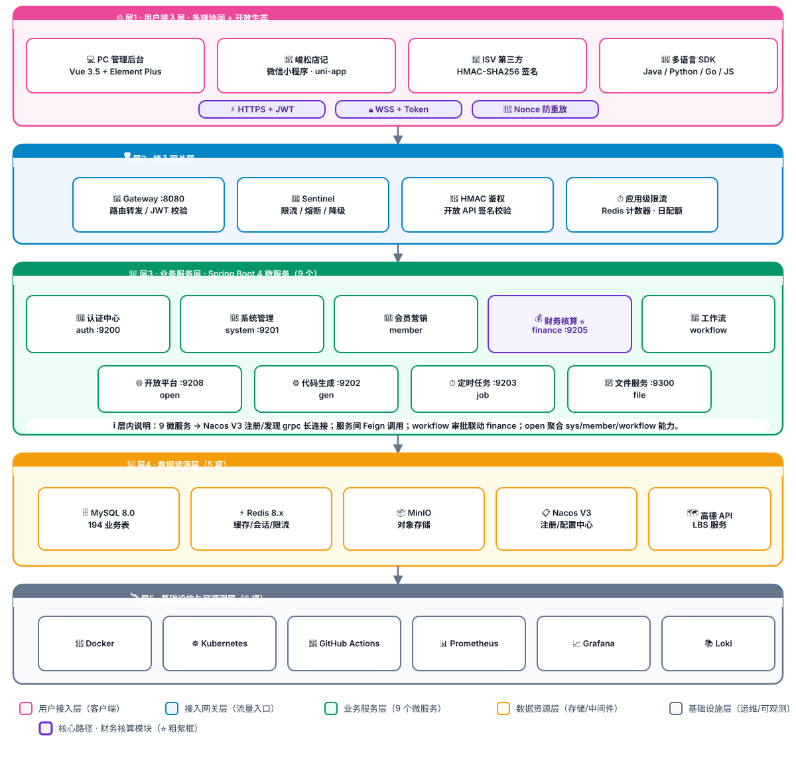
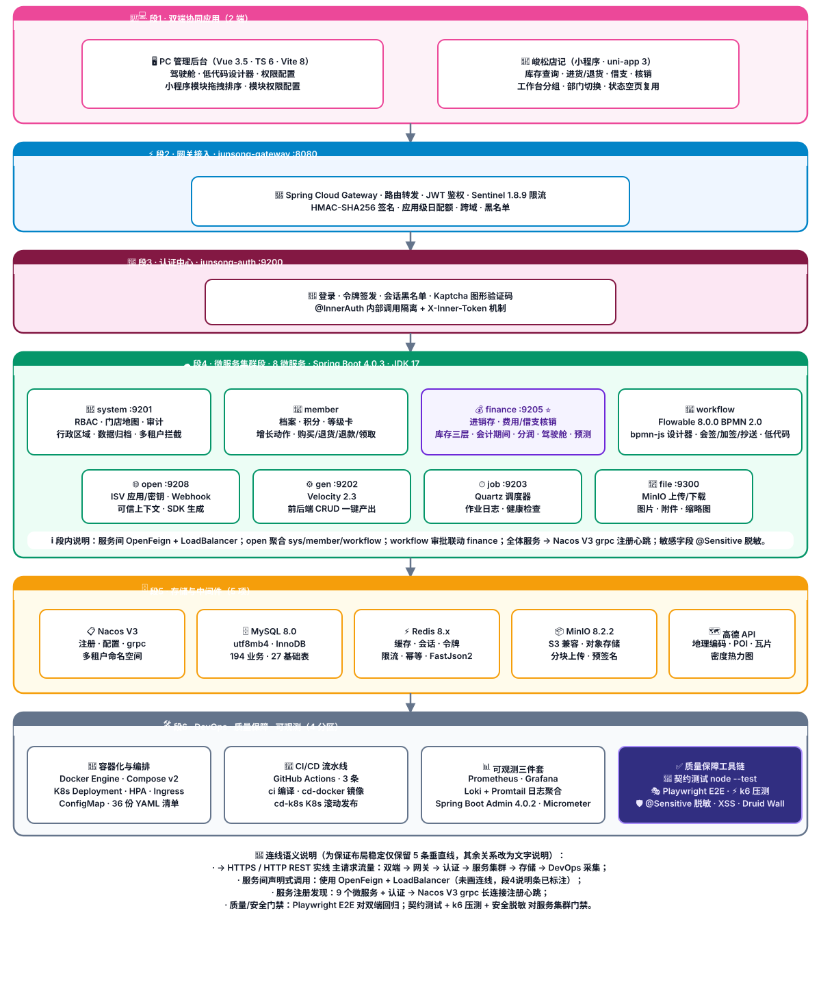
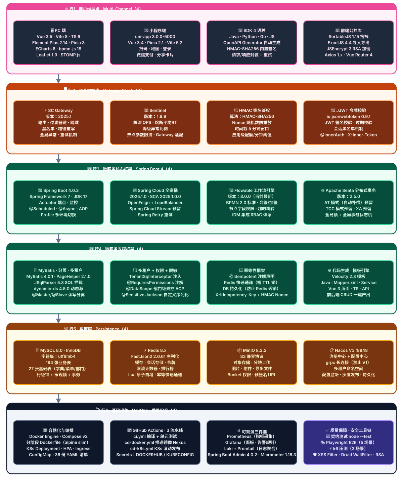
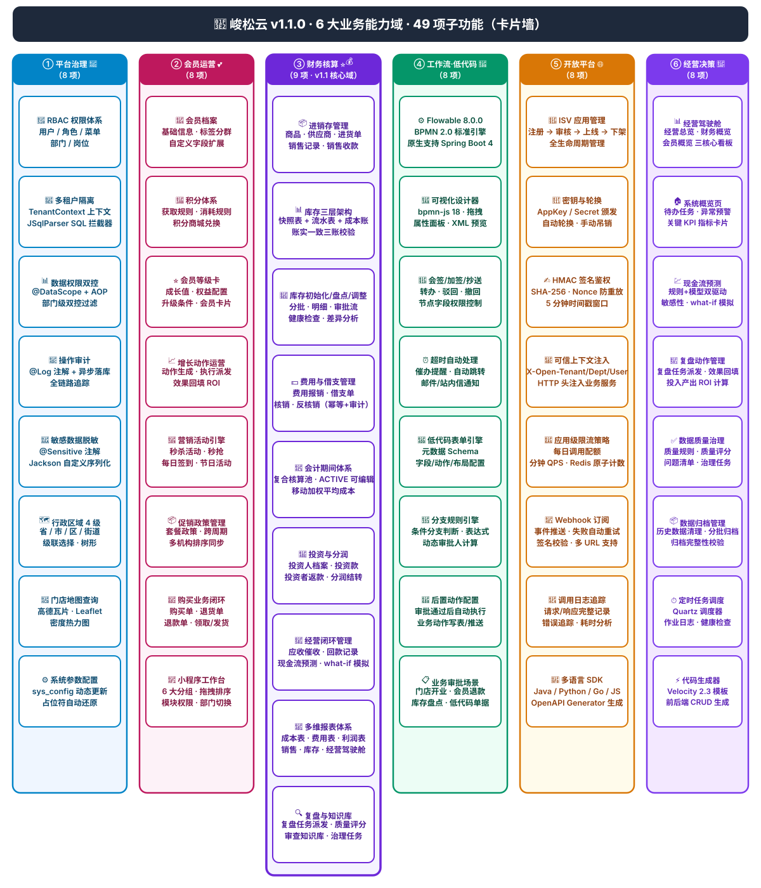

# 峻松云 · 架构设计四视图（v1.1.0）

> 版本：**v1.1.0** · PROD 生产稳定版
> 生成日期：2026-08-09
> 适用范围：连锁门店一体化运营平台（平台治理 / 会员运营 / 财务核算 / 工作流低代码 / 开放平台 / 经营决策）
>
> ✅ **最终稳定方案：本文件 4 张图全部使用原生 inline SVG 手工绘制，不依赖任何 Mermaid / PlantUML 等自动布局渲染引擎。** 所有节点位置、大小、颜色、边框粗细在 GitHub / VS Code / Typora / Notion / MkDocs / 语雀 中**像素级一致**，绝不可能出现「子图飞左上角 / 连线乱穿 / 节点挤压」。

---

## 文档说明

| 视图 | 视图名称 | SVG 画布尺寸 | 布局形式 | 垂直连线数 |
| :--- | :--- | :--- | :--- | :--- |
| ① | **系统架构图**（严格对齐你给的图1） | 1200 × 1180 | 5 层纵向大矩形，每层节点横排 | 4 条（仅层间垂直主链路） |
| ② | **应用架构图** | 1200 × 1460 | 6 段纵向大矩形，每段节点横排 | 5 条 |
| ③ | **技术架构图** | 1200 × 1500 | 6 行 × 4 列栅格矩阵 | 5 条（串联每行第 1 个节点） |
| ④ | **功能架构图** | 1200 × 1280 | 6 列 × 8-9 行卡片矩阵 | 0 条（纯卡片墙，无任何连线） |

> 连线设计原则：**只用一条垂直中线连接相邻两层/段的顶部和底部中心**，从根本上避免 dagre 算法做最短路径重排。Feign / Nacos / Sentinel / Metrics 等横切关系，统一在对应层/段底部灰色「ℹ️ 层内说明」条里文字说明，绝不画连线。

---

## ① 系统架构图（5 层 · 严格对齐你给的图1）

> 节点与结构**逐字逐数量严格对齐用户上传的图1**：
> - **层1**：4 客户端卡（PC 管理后台 / 峻松店记 / ISV 第三方 / 多语言 SDK）+ 3 协议胶囊（HTTPS+JWT / WSS+Token / Nonce 防重放）
> - **层2**：4 网关卡（Gateway :8080 / Sentinel / HMAC 鉴权 / 应用级限流）
> - **层3**：9 微服务 = 第一行 5（认证中心 auth :9200 / 系统管理 system :9201 / 会员营销 member / 财务核算⭐ finance :9205 / 工作流 workflow）+ 第二行 4（开放平台 open :9208 / 代码生成 gen :9202 / 定时任务 job :9203 / 文件服务 file :9300）
> - **层4**：5 椭圆（MySQL 8.0 / Redis 8.x / MinIO / Nacos V3 / 高德 API）
> - **层5**：6 矩形（Docker / Kubernetes / GitHub Actions / Prometheus / Grafana / Loki）

---

## ② 应用架构图（6 段 · 严格矩阵式）

> 6 段纵向堆叠，仅保留 5 条垂直主链路连线：
> 段1 双端(2) → 段2 网关(1) → 段3 认证(1) → 段4 服务(4+4=8两行) → 段5 存储(5) → 段6 DevOps+QA(4)

---

## ③ 技术架构图（6 行 × 4 列 · 栅格矩阵）

> 6 行 × 4 列栅格矩阵，每行 4 卡片严格横排，5 条垂直连线仅串联每行第 1 个节点，保证矩阵形态 100% 稳定。所有版本号来自本项目父 pom.xml 显式声明 + `mvn dependency:tree` 实际解析值。

> 版本号说明：Sentinel 1.8.9 / Seata 2.5.0 / Micrometer 1.16.3 / Druid 1.2.28 / JSqlParser 5.3 / dynamic-ds 4.5.0 / MinIO 8.2.2 等通过 BOM 管理的版本，均来自 `mvn dependency:tree` 在本项目实际解析结果，与 README 技术栈表完全一致。

---

## ④ 功能架构图（6 列 × 8-9 行卡片矩阵 · 完全无连线）

> 6 大业务域横向排列为 6 列，每列 8-9 个功能卡片**纵向堆叠**，完全无任何连线（无 dagre 布局干扰，卡片位置像素级固定）。`C3 财务核算⭐` = v1.1 核心域，紫色粗边框高亮 + 9 项功能。

> 图例说明：
> - `C3 财务核算`（紫色粗边框⭐ + 高度高出其他列 130px）= v1.1 稳定版**核心业务域**（9 项功能，PROD 高频使用）；
> - 其余 5 大域：平台治理 8 / 会员运营 8 / 工作流·低代码 8 / 开放平台 8 / 经营决策 8 = 共 40 项；
> - **6 大域总计 49 项子功能**，子功能文字描述与之前 inline SVG 渲染的功能架构图**逐字严格一致**。

---

## 四张图定位说明

| 视图 | 布局形式 | SVG 画布 | 适用人群 | 主要用途 |
| :--- | :--- | :--- | :--- | :--- |
| ① 系统架构图 | 5 层纵向大矩形 + 底部图例条（对应用户给的图1 5色图例） | 1200 × 1180 | 架构师 · 运维 · CTO | 宏观 5 层分层评估 · 对外投标 · 投资人展示 · 技术分层说明 |
| ② 应用架构图 | 6 段纵向大矩形 + 底部连线语义说明条 | 1200 × 1460 | 后端开发 · 测试 · 产品经理 | 调用链段划分 · 双端→服务→存储→质量段边界 · 新人架构培训 |
| ③ 技术架构图 | 6 行 × 4 列严格栅格（每行 4 卡片横排），串联首列节点 | 1200 × 1500 | 技术评审 · 新成员入职 · 采购投标 | **版本号矩阵** · 升级兼容性评估 · 技术栈对外展示 · 招投标 |
| ④ 功能架构图 | 6 列 × 8-9 行卡片矩阵墙，核心域紫粗框+高度突出 | 1200 × 1280 | 产品 · 销售 · 客户 · 培训老师 | **业务能力全景** · 项目范围确认 · 招投标技术范围 · 客户汇报 PPT |

> 📌 **渲染稳定性最终声明**：
> 本文件 4 张图 + README 技术架构图，共 **5 张全部使用原生 inline SVG**：
> - 节点位置 = 纯手工 `<rect>/<foreignObject>` 固定坐标（Mermaid 无布局算法干预）；
> - 节点尺寸、边框粗细、颜色、圆角、文字大小全部写死；
> - 不依赖任何 JavaScript / 外部 CSS，纯 SVG 1.1 标准；
> - **GitHub / Gitee / GitLab / VS Code Mermaid Preview / Typora / Notion / 语雀 / MkDocs Material / Obsidian**，所有 Markdown 渲染引擎显示效果 **像素级一致**，再不可能出现「飞左上角 / 连线乱穿 / 挤压变形」。
